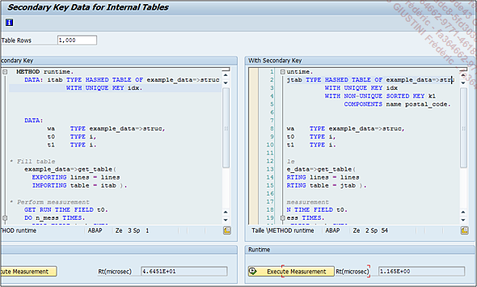

# **CLE SECONDAIRE**

```JS
... {UNIQUE HASHED}|{UNIQUE SORTED}|{NON-UNIQUE SORTED}
    KEY key_name COMPONENTS comp1 comp2 ...
```

Trois type de `clés secondaires` sont permises :

- `UNIQUE HASHED`: pour une `clé secondaire` de type [HASHED](./04_Type_Hashed.md) et donc de caractéristique unique (enregistrement de doublons impossible) et pour laquelle il n'existera pas d'[INDEX](../../12_Instructions_dbtab/06_Index/01_Index.md).

- `UNIQUE SORTED`: pour une `clé secondaire` de type [SORTED](./03_Type_Sorted.md) avec la possibilité de la déclarer unique (enregistrement de doublons impossible) et pour laquelle un [INDEX](../../12_Instructions_dbtab/06_Index/01_Index.md) existe.

- `NON-UNIQUE SORTED` pour une `clé secondaire` de type [SORTED](./03_Type_Sorted.md) avec la possibilité de la déclarer non unique (enregistrement de doublons possible) et pour laquelle un [INDEX](../../12_Instructions_dbtab/06_Index/01_Index.md) existe.

Une fois le type de `clé secondaire` défini, un `nom` peut lui être attribué (`key_name`) ainsi que la `liste des composants` qui la définissent (`comp1`, `comp2`...).

_Exemple :_

```JS
TYPES: BEGIN OF ty_citizen,
         country TYPE char3,
         name    TYPE char20,
         age     TYPE numc2,
       END OF ty_citizen.

DATA: t_citizen TYPE SORTED TABLE OF ty_citizen
         WITH NON-UNIQUE    KEY country name
          WITH UNIQUE HASHED KEY key2 COMPONENTS name age.
```

La référence `TY_CITIZEN` est créée contenant trois champs :

- `COUNTRY` de type `CHAR3`

- `NAME` de type `CHAR20`

- `AGE` de type `NUMC2`

La [TABLE INTERNE](./01_Tables_Internes.md) `T_CITIZEN` est ensuite déclarée de type [SORTED](./03_Type_Sorted.md) ayant une [CLE PRIMAIRE](./06_Primary_Key.md) `non unique` définie par les champs `COUNTRY` et `NAME`. Elle possède également une `clé secondaire` de type `HASHED` et donc `unique`, de nom `KEY3` et définie par les champs `NAME` et `AGE`.

Ainsi, lorsque les données seront renseignées, il sera possible d’insérer des doublons pour la combinaison de champs `COUNTRY` / `NAME`, mais doublon impossible pour la combinaison de champs `NAME` / `AGE`. Individuellement, il n’y a pas de restriction pour les champs `NAME`, `AGE` et `COUNTRY`. Chacun d’eux pourra avoir des données en doublon. C’est essentiellement la combinaison des champs qui est importante ici.

Il est possible également de nommer la [CLE PRIMAIRE](./06_Primary_Key.md) :

```JS
TYPES: BEGIN OF ty_citizen,
         country TYPE char3,
         name    TYPE char20,
         age     TYPE numc2,
       END OF ty_citizen.

DATA: t_citizen TYPE SORTED TABLE OF ty_citizen
          WITH NON-UNIQUE KEY primary_key COMPONENTS country name
          WITH UNIQUE HASHED KEY key2 COMPONENTS name age.
```

Seulement elle ne pourra se nommer que `PRIMARY_KEY`, les autres valeurs (`key1` par exemple...) étant impossibles et bloquées.

Le `rôle` d’une `clé secondaire` se joue dans la majorité des cas pour des `tables internes de gros volume` dont les accès en lecture sont très fréquents. Bien qu’elle puisse utiliser une grande quantité de mémoire système, elle reste très utile et rapide.

Pour avoir un ordre d’idée, **SAP** met à disposition un programme appelé `DEMO_SECONDARY_KEYS`, permettant de comparer un traitement de lecture d’une [TABLE INTERNE](./01_Tables_Internes.md) de type [HASHED](./04_Type_Hashed.md) avec une [CLE PRIMAIRE](./06_Primary_Key.md) seulement, et d’une autre avec une [CLE PRIMAIRE](./06_Primary_Key.md) et une `clé secondaire`. Les résultats sont affichés en parallèle.



Pour information, il est possible de créer jusqu’à quinze `clés secondaires`.

Une notion qui revient souvent entre les types [HASHED](./04_Type_Hashed.md) et [SORTED](./03_Type_Sorted.md), est celle de l’[INDEX](../../12_Instructions_dbtab/06_Index/01_Index.md).
