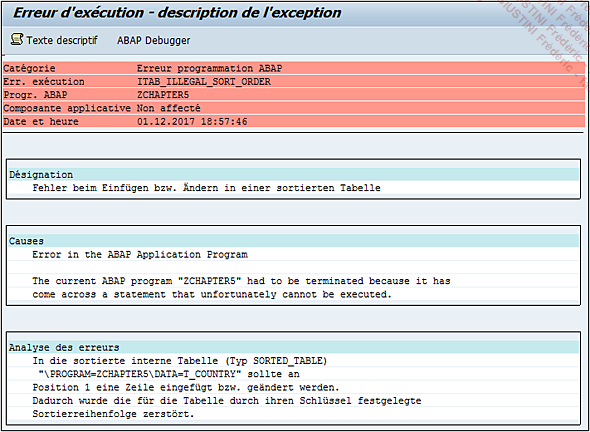

# **APPEND TO ITAB**

```JS
APPEND   wa
      | {INITIAL LINE}
      | {LINES OF jtab [FROM idx1] [TO idx2]} ...
  TO itab.
```

L’instruction `APPEND` possède les mêmes options que l’instruction [INSERT](./01_Append_to_itab.md) à part pour le paramètre de destination, qui sera toujours une [TABLE INTERNE](../../10_Tables_Internes/01_Tables_Internes.md) avec `TO itab`.

_Exemple_

L’exemple précédent peut être complété par les lignes suivantes :

```JS
. . .
s_citizen-country = 'ES'.
s_citizen-name    = 'Luiza'.
s_citizen-age     = '31'.
APPEND s_citizen TO t_citizen1.

s_citizen-country = 'BR'.
s_citizen-name    = 'Felipe'.
s_citizen-age     = '25'.
APPEND s_citizen TO t_citizen1.
```

T_CITIZEN1

| **COUNTRY** | **NAME**  | **AGE** |
| :---------: | --------- | :-----: |
|     BR      | Renata    |   27    |
|     FR      | Florianne |   32    |
|             |           |         |
|     FR      | Thierry   |   24    |
|     ES      | Luiza     |   31    |
|     BR      | Felipe    |   25    |

L’instruction `APPEND` fonctionne pour les tables de type [STANDARD](../../10_Tables_Internes/02_Type_Standard.md) et [RANGE](../../10_Tables_Internes/05_Type_Range.md). Pour les [TABLES INTERNES](../../10_Tables_Internes/01_Tables_Internes.md) de type [HASHED](../../10_Tables_Internes/04_Type_Hashed.md) et [SORTED](../../10_Tables_Internes/03_Type_Sorted.md), il est obligatoire d’utiliser l’instruction [INSERT WA INTO TABLE itab](../01_Insert/01_Insert_into_itab.md).

    Petite parenthèse, il est possible d’utiliser l’instruction APPEND avec les types de tables internes SORTED mais comme l’APPEND insère toujours une ligne en fin de table, si l’enregistrement inséré modifie l’ordre défini par la clé primaire, alors le programme retournera un DUMP.

_Exemple_

Ajouter les pays `ES` puis `BR` à une [TABLE INTERNE](../../10_Tables_Internes/01_Tables_Internes.md) de type [SORTED](../../10_Tables_Internes/03_Type_Sorted.md) avec comme [CLE PRIMAIRE](../../10_Tables_Internes/06_Primary_Key.md) le champ `LAND`.

```JS
TYPES: BEGIN OF ty_country,
         land TYPE char3,
       END OF ty_country.

DATA: t_country TYPE SORTED TABLE OF ty_country WITH NON-UNIQUE KEY land,
      s_country TYPE ty_country.

s_country-land = 'ES'.
APPEND s_country TO t_country.

s_country-land = 'BR'.
APPEND s_country TO t_country.
```

Selon la [CLE PRIMAIRE](../../10_Tables_Internes/06_Primary_Key.md) de la table, la valeur `BR` doit être avant `ES`. Dans ce cas, l’exécution du programme retournera un [DUMP](../../07_Dump/01_Dump.md) (en allemand).



_Exemple_

Ajouter les pays `ES` puis `BR` à une [TABLE INTERNE](../../10_Tables_Internes/01_Tables_Internes.md) de type [SORTED](../../10_Tables_Internes/03_Type_Sorted.md) avec comme [CLE PRIMAIRE](../../10_Tables_Internes/06_Primary_Key.md) le champ `LAND`.

```JS
TYPES: BEGIN OF ty_country,
         land TYPE char3,
       END OF ty_country.

DATA: t_country TYPE SORTED TABLE OF ty_country WITH NON-UNIQUE KEY land,
      s_country TYPE ty_country.

s_country-land = 'BR'.
APPEND s_country TO t_country.

s_country-land = 'ES'.
APPEND s_country TO t_country.
```

Cette fois-ci l’ordre de la [CLE PRIMAIRE](../../10_Tables_Internes/06_Primary_Key.md) est respecté, pas de [DUMP](../../07_Dump/01_Dump.md) et le programme se termine correctement.
