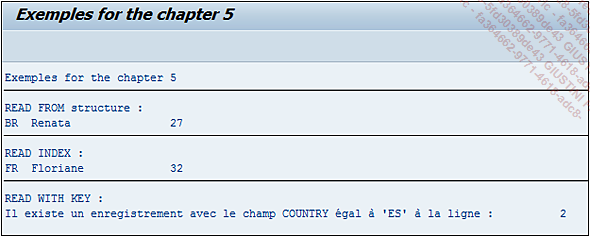
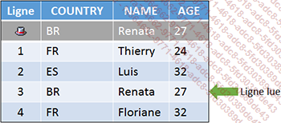
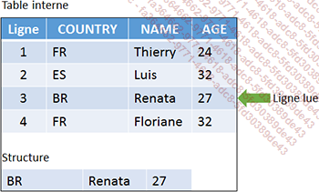

# **READ TABLE**

```JS
READ TABLE itab
  {   FROM wa }
    | WITH KEY { comp1 = obj1 comp2 = obj2 ... [BINARY SEARCH]
    | INDEX idx
  }
  {   INTO wa }
    | ASSIGNING <fs>
    | TRANSPORTING NO FIELDS
  .
```

Le `READ TABLE` permet de lire une ligne de la [TABLE INTERNE](../../10_Tables_Internes/01_Tables_Internes.md) `itab`. Cette opération s'effectue soit en définissant une [STRUCTURE](../../10_Tables_Internes/01_Tables_Internes.md) source contenant les valeurs des champs à lire (`FROM wa`), soit en définissant directement des valeurs pour des composants (`WITH KEY comp1 = obj1...`), soit en lisant directement une ligne via son [INDEX](../../12_Instructions_dbtab/06_Index/01_Index.md) (`INDEX idx`).

De plus, le résultat peut être stocké dans une [STRUCTURE](../../10_Tables_Internes/01_Tables_Internes.md) (`INTO wa`), ou dans un `FIELD SYMBOL` (`ASSIGNING <fs>`), mais il est également possible de ne pas le stocker afin de vérifier seulement si la ligne existe (`TRANSPORTING NO FIELD`), en mettant à jour les variables système [SY-SUBRC](../../help/02_SY-SYSTEM.md) (code retour) et [SY-TABIX](../../help/02_SY-SYSTEM.md) ([INDEX](../../12_Instructions_dbtab/06_Index/01_Index.md) de la table retourné par la recherche). Ces paramètres sont `obligatoires` pour des `tables n'ayant pas d'en-tête`.

D'une vision très générale, un `FIELD SYMBOL` (appelé `pointeur`) est un type de variable faisant référence à la zone mémoire d'une [STRUCTURE](../../10_Tables_Internes/01_Tables_Internes.md), [TABLE INTERNE](../../10_Tables_Internes/01_Tables_Internes.md)... et qui est déclaré par la commande `FIELD-SYMBOLS`. Non seulement son utilisation diminue considérablement le temps de traitement mais en plus, faisant référence directement à une zone mémoire, elle peut modifier directement la valeur de celle-ci (sans utiliser des instructions comme `MODIFY` dans le cas d'une [TABLE INTERNE](../../10_Tables_Internes/01_Tables_Internes.md)...). L'allocation à une zone mémoire se fait par la commande `ASSIGN` ou `ASSIGNING`.

_Exemple_

_Après avoir remplui la table interne `T_CITIZEN`, trois `READ TABLE` vont être effectués._

```JS
TYPES: BEGIN OF ty_citizen,
         country TYPE char3,
         name    TYPE char20,
         age     TYPE numc2,
       END OF ty_citizen.

DATA: t_citizen TYPE STANDARD TABLE OF ty_citizen,
      s_citizen TYPE ty_citizen.

FIELD-SYMBOLS: <fs_citizen> TYPE ty_citizen.

s_citizen-country = 'FR'.
s_citizen-name    = 'Thierry'.
s_citizen-age     = '24'.
APPEND s_citizen TO t_citizen.

s_citizen-country = 'ES'.
s_citizen-name    = 'Luis'.
s_citizen-age     = '32'.
APPEND s_citizen TO t_citizen.

s_citizen-country = 'BR'.
s_citizen-name    = 'Renata'.
s_citizen-age     = '27'.
APPEND s_citizen TO t_citizen.

s_citizen-country = 'FR'.
s_citizen-name    = 'Floriane'.
s_citizen-age     = '32'.
APPEND s_citizen TO t_citizen.

s_citizen-country = 'BR'.
s_citizen-name    = 'Renata'.
s_citizen-age     = '27'.
READ TABLE t_citizen ASSIGNING <fs_citizen> FROM s_citizen.
IF sy-subrc = 0.
  WRITE: 'READ FROM structure :'.
  WRITE:/ <fs_citizen>-country, <fs_citizen>-name, <fs_citizen>-age.
ENDIF.
ULINE.

READ TABLE t_citizen INTO s_citizen INDEX 4.
IF sy-subrc = 0.
  WRITE:/ 'READ INDEX :'.
  WRITE:/ s_citizen-country, s_citizen-name, s_citizen-age.
ENDIF.
ULINE.

SORT t_citizen BY country.
READ TABLE t_citizen WITH KEY country = 'ES' BINARY SEARCH
                     TRANSPORTING NO FIELDS.
IF sy-subrc = 0.
  WRITE:/ 'READ WITH KEY :'.
  WRITE:/ 'Il existe un enregistrement avec le champ COUNTRY égal à ''ES''
à la ligne :', sy-tabix.
ENDIF.
```

L'instruction `ULINE` permet d'afficher une ligne horizontale (`UnderLine`). Dans le même genre, `VLINE` trace quant à elle une ligne verticale.



Pour revenir sur la notion d'en-tête, si la [TABLE INTERNE](../../10_Tables_Internes/01_Tables_Internes.md) `T_CITIZEN` est déclarée de cette manière :

```JS
DATA: t_citizen TYPE STANDARD TABLE OF ty_citizen
                WITH HEADER LINE,
```

Et que le `READ TABLE` suivant est exécuté :

```JS
...
SORT t_citizen BY country.
READ TABLE t_citizen WITH KEY country = 'ES' BINARY SEARCH.
...
```

Alors le résultat est automatiquement stocké dans la ligne d'en-tête de la [TABLE INTERNE](../../10_Tables_Internes/01_Tables_Internes.md). Les deux schémas suivants montrent la différence entre la [TABLE INTERNE](../../10_Tables_Internes/01_Tables_Internes.md) `T_CITIZEN` avec en-tête et sans en-tête (et utilisation d'une [STRUCTURE](../../10_Tables_Internes/01_Tables_Internes.md) en parallèle) :

**Table interne avec en-tête**



**Table interne sans en-tête**


