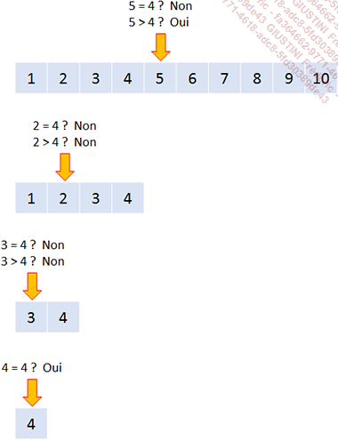

# **BINARY SEARCH**

Lors de l'utilisation du [READ TABLE WITH KEY](../07_Read/01_Read_itab.md), il est fortement recommandé d'utiliser l'option `BINARY SEARCH`, car cela favorisa une recherche `binaire` de la [TABLE INTERNE](../../10_Tables_Internes/01_Tables_Internes.md) améliorant ainsi les performances du programme.

Une `recherche binaire` répond à l'[ALGORITHME](../../01_Introduction/03_Algorithme.md) suivant :

- Si elle est égale à la valeur recherchée, alors l'[INDEX](../../12_Instructions_dbtab/06_Index/01_Index.md) de la ligne est retourné et la recherche est terminée.

- Sinon, si elle est supérieure à la valeur recherchée, la moitié inférieure sera isolée, puis de nouveau le programme regardera la valeur du milieu de cette moitié, si elle est égale à la valeur recherchée....

_Exemple_

_Sur une liste de nombres de 1 à 10, on souhaite trouver la position de 4. Suivant l'[ALGORITHME](../../01_Introduction/03_Algorithme.md) précédent, on va donc procéder comme suit :_

Pour utiliser le `BINARY SEARCH`, il est obligatoire d'orgnaiser les données avec un [SORT](../../11_Instructions_itab/06_Sort/01_Sort_itab.md) (sauf dans le cas d'une [TABLE INTERNE](../../10_Tables_Internes/01_Tables_Internes.md) de type [SORTED](../../10_Tables_Internes/03_Type_Sorted.md)).
