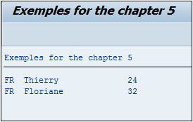
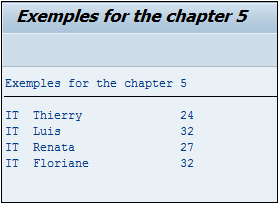

# **LOOP**

```JS
LOOP AT itab { INTO wa }
               | ASSIGNING <fs>
               | TRANSPORTING NO FIELDS
             }
             [FROM idx1] [TO idx2]
             [WHERE log_exp]
  ...
  AT ...
    ...
  ENDAT.
  ...
ENDLOOP.
```

## CARACTERISTIQUES

Deux types de [BOUCLES](../../06_Boucles/README.md) ont été vues : le [DO/ENDDO](../../06_Boucles/01_Do_Enddo.md) et le [WHILE/ENDWHILE](../../06_Boucles/05_While_Endwhile.md). Cependant il existe une troisième plus adaptée aux [TABLE INTERNE](../../10_Tables_Internes/01_Tables_Internes.md) : le `LOOP`.

Un `LOOP` va lire ligne par ligne la [TABLE INTERNE](../../10_Tables_Internes/01_Tables_Internes.md) `itab` et comme pour le [READ TABLE](../../11_Instructions_itab/07_Read/01_Read_itab.md), le résultat peut être stocké dans une [STRUCTURE](../../10_Tables_Internes/01_Tables_Internes.md) (`INTO wa`), ou dans un `FIELD SYMBOL` (`ASSIGNING <fs>`), mais il est également possible de na pas le stocker afin de vérifier seulement si la ligne existe (`TRANSPORTING NO FIELDS`) en mettant à jour les variables système [SY-SUBRC](../../help/02_SY-SYSTEM.md) (code retour) et [SY-TABIX](../../help/02_SY-SYSTEM.md) ([INDEX](../../12_Instructions_dbtab/06_Index/01_Index.md) de la table lue dans la boucle).

Aussi, deux paramètres optionnels sont disponibles comme pour le [DELETE](../../11_Instructions_itab/05_Delete/README.md) (suppression de plusieurs lignes) : `FROM idx1` et/ou `TO idx2` permettant de restreindre la boucle à une sélection de lignes, et la clause `WHERE` permettant d'effectuer une sélection d'un ou plusieurs champs.

_Exemple_

_Boucle sur la table `T_CITIZEN` dont le champ `COUNTRY` est égal à `FR`, et affichage de la ligne._

```JS
TYPES: BEGIN OF ty_citizen,
         country TYPE char3,
         name    TYPE char20,
         age     TYPE numc2,
       END OF ty_citizen.

DATA: t_citizen TYPE STANDARD TABLE OF ty_citizen,
      s_citizen TYPE ty_citizen.

FIELD-SYMBOLS: <fs_citizen> TYPE ty_citizen.

s_citizen-country = 'FR'.
s_citizen-name    = 'Thierry'.
s_citizen-age     = '24'.
APPEND s_citizen TO t_citizen.

s_citizen-country = 'ES'.
s_citizen-name    = 'Luis'.
s_citizen-age     = '32'.
APPEND s_citizen TO t_citizen.

s_citizen-country = 'BR'.
s_citizen-name    = 'Renata'.
s_citizen-age     = '27'.
APPEND s_citizen TO t_citizen.

s_citizen-country = 'FR'.
s_citizen-name    = 'Floriane'.
s_citizen-age     = '32'.
APPEND s_citizen TO t_citizen.

LOOP AT t_citizen ASSIGNING <fs_citizen> WHERE country = 'FR'.
  WRITE: / <fs_citizen>-country, <fs_citizen>-name, <fs_citizen>-age.
ENDLOOP.
```



Petit complément concernant le `FIELD SYMBOL`. Il a été vu qu’il était possible de modifier directement la valeur de la `zone mémoire` référant à une variable, et que dans le cas d’une table interne, il n’était donc pas nécessaire d’utiliser la commande [MODIFY](../../11_Instructions_itab/04_Modify/README.md) pour appliquer ces modifications. Pour bien comprendre ce point, l’exemple précédent va être repris, sauf qu’avant la boucle utilisée pour lire les valeurs, une autre va affecter la valeur `IT` au champ `COUNTRY`.

```JS
. . .

LOOP AT t_citizen ASSIGNING <fs_citizen>.
  <fs_citizen>-country = 'IT'.
ENDLOOP.

LOOP AT t_citizen ASSIGNING <fs_citizen>.
  WRITE: / <fs_citizen>-country, <fs_citizen>-name, <fs_citizen>-age.
ENDLOOP.
```

**T_CITIZEN avant la première boucle**

| **COUNTRY** | **NAME** | **AGE** |
| ----------- | -------- | ------- |
| FR          | Thierry  | 24      |
| ES          | Luis     | 32      |
| BR          | Renata   | 27      |
| FR          | Floriane | 32      |



Avec le `FIELD SYMBOL`, une simple affectation a suffi pour mettre à jour les champs de la table interne.
