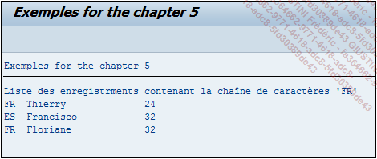

# **FIND IN TABLE**

```JS
FIND [{FIRST OCCURRENCE}|{ALL OCCURRENCES} OF] pattern
     IN TABLE itab [table_range]
     [IN {CHARACTER|BYTE} MODE]
... [{RESPECTING|IGNORING} CASE]
    [MATCH COUNT  mcnt]
    { {[MATCH LINE   mlin]
       [MATCH OFFSET moff]
       [MATCH LENGTH mlen]}
    | [RESULTS result_tab|result_wa] }.
```

L’instruction `FIND IN TABLE` possède les mêmes paramètres et se comporte exactement de la même façon que l’instruction [FIND](../../04_Variables/07_Find.md) dans une variable.

_Exemple_

_Chercher toutes les occurrences `FR` dans la table `T_CITIZEN` et afficher les lignes concernées._

```JS
TYPES: BEGIN OF ty_citizen,
         country TYPE char3,
         name    TYPE char20,
         age     TYPE numc2,
       END OF ty_citizen.

DATA: t_citizen TYPE STANDARD TABLE OF ty_citizen,
      t_results TYPE TABLE OF match_result,
      s_citizen TYPE ty_citizen,
      s_results TYPE match_result.

FIELD-SYMBOLS: <fs_citizen> TYPE ty_citizen.

s_citizen-country = 'FR'.
s_citizen-name    = 'Thierry'.
s_citizen-age     = '24'.
APPEND s_citizen TO t_citizen.

s_citizen-country = 'ES'.
s_citizen-name    = 'Francisco'.
s_citizen-age     = '32'.
APPEND s_citizen TO t_citizen.

s_citizen-country = 'BR'.
s_citizen-name    = 'Renata'.
s_citizen-age     = '27'.
APPEND s_citizen TO t_citizen.

s_citizen-country = 'FR'.
s_citizen-name    = 'Floriane'.
s_citizen-age     = '32'.
APPEND s_citizen TO t_citizen.

FIND ALL OCCURRENCES OF 'FR' IN TABLE t_citizen
         IGNORING CASE
         RESULTS t_results.

IF sy-subrc = 0.

  LOOP AT t_results INTO s_results.

    AT FIRST.
      WRITE: 'Liste des enregistrements contenant la chaîne
de caractères ''FR'''.
    ENDAT.

    READ TABLE t_citizen ASSIGNING <fs_citizen> INDEX s_results-line.
    IF sy-subrc = 0.
      WRITE: / <fs_citizen>-country, <fs_citizen>-name, <fs_citizen>-age.
    ENDIF.

  ENDLOOP.

ENDIF.
```

Une nouvelle [TABLE INTERNE](../../10_Tables_Internes/01_Tables_Internes.md) va être créée `T_RESULTS`, de référence `MATCH_RESULT`, [STRUCTURE](../../10_Tables_Internes/01_Tables_Internes.md) standard utilisée pour stocker les résultats de l'instruction `FIND`. Après avoir rempli la [TABLE INTERNE](../../10_Tables_Internes/01_Tables_Internes.md) `T_CITIZEN`, le `FIND` sera exécuté avec la chaîne de caractère `FR` pour la [TABLE INTERNE](../../10_Tables_Internes/01_Tables_Internes.md) `T_CITIZEN`, sans prendre en compte la casse et stockant donc le résultat dans la table `T_RESULTS`.

**T_RESULTS**

| **LINE** | **OFFSET** | **LENGTH** | **...** |
| -------- | ---------- | ---------- | ------- |
| 1        | 0          | 2          | ...     |
| 2        | 3          | 2          | ...     |
| 3        | 0          | 2          | ...     |

Pour rappel, le premier champ liste les [INDEX](../../12_Instructions_dbtab/06_Index/01_Index.md) de lignes concernées par cette recherche, `OFFSET` la position où ma chaîne de caractère a été trouvée, `LENGTH` la longueur de la chaîne de caractères.

Le champ `LINE` sera ensuite utilisé dans le `LOOP` de la table `T_RESULTS`, pour lire l'[INDEX](../../12_Instructions_dbtab/06_Index/01_Index.md) de la table `T_CITIZEN` et d'en afficher sa ligne.

_Résultat_


