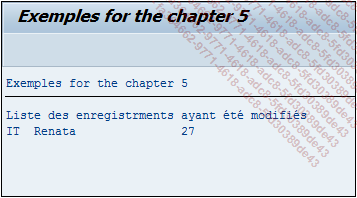

# **REPLACE IN TABLE**

```JS
REPLACE [{FIRST OCCURRENCE}|{ALL OCCURRENCES} OF] pattern
        IN TABLE itab WITH new
        [IN {CHARACTER|BYTE} MODE]
... [{RESPECTING|IGNORING} CASE]
    [REPLACEMENT COUNT  rcnt]
    { {[REPLACEMENT LINE rlin]
       [REPLACEMENT OFFSET roff]
       [REPLACEMENT LENGTH rlen]}
    | [RESULTS result_tab|result_wa] } ...
```

L'instruction `REPLACE IN TABLE` possède les mêmes paramètre et se comporte exactement de la même façon que l'instruction [REPLACE](../../04_Variables/08_Replace.md) dans une [VARIABLE](../../04_Variables/01_Variables.md).

_Exemple_

_Cercher toutes les occurrences `BR` dans la table `T_CITIZEN` et les remplacer par la chaîne de caractère `IT`._

```JS
TYPES: BEGIN OF ty_citizen,
         country TYPE char3,
         name    TYPE char20,
         age     TYPE numc2,
       END OF ty_citizen.

DATA: t_citizen TYPE STANDARD TABLE OF ty_citizen,
      t_results TYPE TABLE OF repl_result,
      s_citizen TYPE ty_citizen,
      s_results TYPE repl_result.

FIELD-SYMBOLS: <fs_citizen> TYPE ty_citizen.

s_citizen-country = 'FR'.
s_citizen-name    = 'Thierry'.
s_citizen-age     = '24'.
APPEND s_citizen TO t_citizen.

s_citizen-country = 'ES'.
s_citizen-name    = 'Francisco'.
s_citizen-age     = '32'.
APPEND s_citizen TO t_citizen.

s_citizen-country = 'BR'.
s_citizen-name    = 'Renata'.
s_citizen-age     = '27'.
APPEND s_citizen TO t_citizen.

s_citizen-country = 'FR'.
s_citizen-name    = 'Floriane'.
s_citizen-age     = '32'.
APPEND s_citizen TO t_citizen.

REPLACE all OCCURRENCES OF 'BR' IN TABLE t_citizen with 'IT'
            IGNORING CASE
            RESULTS t_results.

IF sy-subrc = 0.

  LOOP AT t_results INTO s_results.

    AT FIRST.
      WRITE: 'Liste des enregistrements ayant été modifiés'.
    ENDAT.

    READ TABLE t_citizen ASSIGNING <fs_citizen> INDEX s_results-line.
    IF sy-subrc = 0.
      WRITE: / <fs_citizen>-country, <fs_citizen>-name, <fs_citizen>-age.
    ENDIF.

  ENDLOOP.

ENDIF.
```

La [TABLE INTERNE](../../10_Tables_Internes/01_Tables_Internes.md) `T_RESULTS` va cette fois-ci prendre la référence de la [STRUCTURE](../../10_Tables_Internes/01_Tables_Internes.md) `REPL_RESULT`.

**T_RESULTS**

| **LINE** | **OFFSET** | **LENGTH** |
| -------- | ---------- | ---------- |
| 3        | 0          | 2          |

Pour rappel, le premier champ liste les [INDEX](../../12_Instructions_dbtab/06_Index/01_Index.md) de lignes concernées par la modification, `OFFSET` la position où la chaîne de caractères a été remplacée, `LENGTH`, la longueur de la chaîne de caractères.

Le champ `LINE` sera ensuite utilisé dans le `LOOP` de la table `T_RESULTS`, pour lire l’`index` de la table `T_CITIZEN` et d’en afficher sa ligne.

_Résultat_


