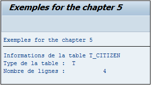

# **DESCRIBE TABLE**

```JS
DESCRIBE TABLE itab [KIND knd] [LINES lin].
```

Cette instruction permet de décrire une [TABLE INTERNE](../../10_Tables_Internes/01_Tables_Internes.md) en retournant les informations suivantes :

- Le type de [TABLE INTERNE](../../10_Tables_Internes/01_Tables_Internes.md) (`KIND knd`) ayant pour valeur

  - `T` : [STANDARD](../../10_Tables_Internes/02_Type_Standard.md)

  - `S` : [SORTED](../../10_Tables_Internes/03_Type_Sorted.md)

  - `H` : [HASHED](../../10_Tables_Internes/04_Type_Hashed.md)

  - `void` (vide/rien/nada) : indéfini

    Ces valeurs se retrouvent également dans la [STRUCTURE STANDARD](../../10_Tables_Internes/02_Type_Standard.md) `SYDES_KIND`.

- Le nombre de lignes contenues dans la [TABLE INTERNE](../../10_Tables_Internes/01_Tables_Internes.md) (`LINES lin`).

_Exemple_

_Retourner toutes les informations de la table `T_CITIZEN`._

```JS
TYPES: BEGIN OF ty_citizen,
         country TYPE char3,
         name    TYPE char20,
         age     TYPE numc2,
       END OF ty_citizen.

DATA: t_citizen TYPE STANDARD TABLE OF ty_citizen,
      s_citizen TYPE ty_citizen.


s_citizen-country = 'FR'.
s_citizen-name    = 'Thierry'.
s_citizen-age     = '24'.
APPEND s_citizen TO t_citizen.

s_citizen-country = 'ES'.
s_citizen-name    = 'Francisco'.
s_citizen-age     = '32'.
APPEND s_citizen TO t_citizen.

s_citizen-country = 'BR'.
s_citizen-name    = 'Renata'.
s_citizen-age     = '27'.
APPEND s_citizen TO t_citizen.

s_citizen-country = 'FR'.
s_citizen-name    = 'Floriane'.
s_citizen-age     = '32'.
APPEND s_citizen TO t_citizen.


DESCRIBE TABLE t_citizen KIND DATA(v_kind) LINES DATA(v_lines).

WRITE : /'Informations de la table T_CITIZEN'.
WRITE : /'Type de la table : ', v_kind.
WRITE : /'Nombre de lignes : ', v_lines.
```

_Résultat_


