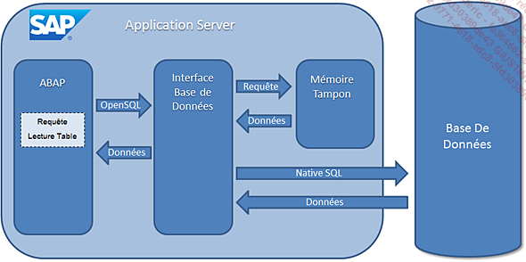
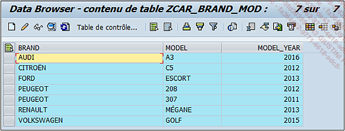
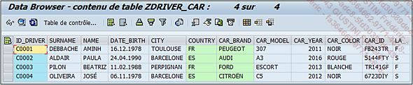
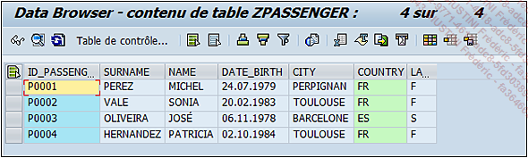
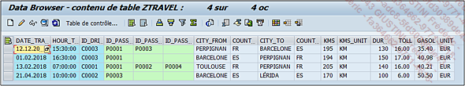

# **SQL**

La définition d’une [TABLE](../../09_Tables_DB/01_Tables.md), faisant référence à un objet du `dictionnaire de données` ([DDIC - SE11](../../08_SE11/01_SE11.md)), a été développée, il reste maintenant à voir comment importer les données de la [BASE DE DONNEES]() et pour cela, **SAP** utilise le langage **SQL**.

Le **SQL** (`signifiant Structured Query Language` - requête de langage structurée en français) est tout simplement le langage de programmation permettant d’accéder et de gérer les données des [BASES DE DONNEES]() (ajout, modification ou suppression). Pour **SAP**, il a été adapté en un ensemble d’opérations `ABAP` appelé `OpenSQL`. Pour schématiser, le traitement des données ressemblerait à ceci :

Une application `ABAP` exécute une `requête SQL`. Il s’agit d’une opération permettant de traiter directement avec la [BASES DE DONNEES](), comme par exemple la lecture d’une [TABLE](../../09_Tables_DB/01_Tables.md), qui sera alors envoyée en `OpenSQL` à une interface. Celle-ci la traduira ensuite en `Native SQL` (`langage SQL adapté pour les bases de données`) afin de consulter la [BASES DE DONNEES](), et d’importer les informations nécessaires. Elles seront enfin retournées via l’interface à l’application `ABAP` qui pourra poursuivre son traitement.

Comme vu dans le chapitre `Dictionnaire de données` ([DDIC - SE11](../../08_SE11/01_SE11.md)), certaines [TABLES](../../09_Tables_DB/01_Tables.md) peuvent être configurées pour l’utilisation d’une `mémoire tampon`. Ainsi les données retournées par la [BASES DE DONNEES]() seront stockées dans cette mémoire et consultées quand nécessaire par l’`application ABAP`.

Il existe de nombreuses instructions pour constituer une `requête SQL`.

    La suite de ce chapitre utilisera les tables créées au chapitre Dictionnaire de données (DDIC) et contiendra les registres suivants (en annexe se trouve un programme permettant de remplir rapidement les tables).

- **ZCAR_BRAND_MOD**

  

- **ZDRIVER_CAR**

  

- **ZPASSENGER**

  

- **ZTRAVEL**

  
