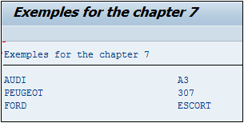

# **DISTINCT**

Avec la fonctionnalité `DISTINCT`, la sélection va supprimer tous les `doublons`.

_Exemple_

_Sélectionner toutes les marques et les modèes des voitures enregistrés dans la table des conducteurs :_

```JS
TYPES: BEGIN OF ty_driver_car,
         car_brand TYPE wrf_brand_descr,
         car_model TYPE vlc_maktx,
       END OF ty_driver_car.

DATA: t_driver_car TYPE TABLE OF ty_driver_car,
      s_driver_car TYPE ty_driver_car.

SELECT DISTINCT car_brand, car_model
    FROM zdriver_car
    INTO TABLE @t_driver_car.

LOOP AT t_driver_car INTO s_driver_car.
  WRITE:/ s_driver_car-car_brand, s_driver_car-car_model.
ENDLOOP.
```

Grâce au `DISTINICT`, la sélection va importer les champs `CAR_BRAND` et `CAR_MODEL` de la [TABLE](../../09_Tables_DB/01_Tables.md) `ZDRIVER_CAR` sans aucun doublon, obtenant ainsi une liste clare des véhicules disponibles pour le coivoiturage. Le résultat de cette requête sera stocké dans la [TABLE INTERNE](../../10_Tables_Internes/01_Tables_Internes.md) `T_DRIVER_CAR` définie par le type `TY_DRIVER_CAR`, contenant les deux champs de la sélection. Une boucle `LOOP` permettra d'afficher le résultat à l'écran.


