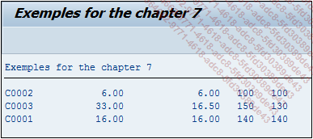

# **COUNT**

Plusieurs fonctions d'agrégats existent sur **SAP** pour les requêtes [SQL](./01_SQL.md).

`SUM ( DISTINCT col )`
`COUNT (*)`
`COUNT ( * )`

Il s’agit ici d’un compteur retournant le nombre d’occurrences d’une colonne donnée. Si pour les autres agrégats, `DISTINCT` était une option, ici c’est un paramètre obligatoire dans le cas où le nom de la colonne a été spécifié. Ainsi, pour savoir combien il existe de villes de destination différentes, la requête suivante peut être utilisée :

```JS
DATA v_count TYPE i.

SELECT COUNT( DISTINCT city_to )
  FROM ztravel
  INTO @v_count.
```

Selon les valeurs enregistrées dans le chapitre [DDIC - SE11](../../08_SE11/01_SE11.md), `V_VOUNT` aura la valeur de 3.

`COUNT(*)` ou `COUNT( * )` permet de compter tout simplement les lignes d'une [TABLE](../../09_Tables_DB/01_Tables.md).

_Exemple_

_Nombre de lignes de la table `ZCAR_BRAND_MOD`_

```JS
DATA v_count TYPE i.

SELECT COUNT( * )
  FROM zcar_brand_mod
  INTO @v_count.
```

Le résultat obtenu sera de sept occurrences dans la [TABLE](../../09_Tables_DB/01_Tables.md) `ZCAR_BRAND_MOD`.

Il est possible aussi d'utiliser plusieurs de ces fonctions d'agrégats dans une requête unique.

_Exemple_

_Pour chaque identification de conducteur, afficher le total des péages payés, leur moyenne, le voyage le plus long, et enfin le plus court :_

```JS
TYPES: BEGIN OF ty_driver_infos,
         id    TYPE zdriver_id,
         total TYPE ztravel_toll,
         moy   TYPE ztravel_toll,
         max   TYPE n1dauer,
         min   TYPE n1dauer,
       END OF ty_driver_infos.

DATA: t_driver_infos TYPE TABLE OF ty_driver_infos,
      s_driver_infos TYPE ty_driver_infos.


SELECT id_driver       AS id,
       SUM( toll )     AS total,
       AVG( toll )     AS moy,
       MAX( duration ) AS max,
       MIN( duration ) AS min
  FROM ztravel
  INTO TABLE @t_driver_infos
  GROUP BY id_driver.

LOOP AT t_driver_infos INTO s_driver_infos.
  WRITE:/ s_driver_infos-id,  s_driver_infos-total,
          s_driver_infos-moy, s_driver_infos-max,
          s_driver_infos-min.
ENDLOOP.
```

La [TABLE INTERNE](../../10_Tables_Internes/01_Tables_Internes.md) `T_DRIVER_INFOS` aura les informations suivantes :

| **ID** | **TOTAL** | **MOY** | **MAX** | **MIN** |
| ------ | --------- | ------- | ------- | ------- |
| C0002  | 6.00      | 6.00    | 100     | 100     |
| C0003  | 33.00     | 16.50   | 150     | 130     |
| C0001  | 16.00     | 16.00   | 140     | 140     |

_Résultat à l'écran_


