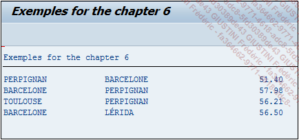

# **EXPRESSIONS ARITHMETIQUES**

Il est possible d'inclure dans la sélection, les opérations arithmétiques entre les champs.

_Exemple_

_Dépense totale pour chaque trajet (péage + essence) :_

```JS
TYPES: BEGIN OF ty_cost,
         city_from  TYPE s_from_cit,
         city_to    TYPE s_to_city,
         total_traj TYPE p DECIMALS 2,
       END OF ty_cost.

DATA: t_cost TYPE TABLE OF ty_cost,
      s_cost TYPE ty_cost.


SELECT city_from,
       city_to,
       ( toll + gasol ) AS total_traj
  FROM ztravel
  INTO TABLE @t_cost.

LOOP AT t_cost INTO s_cost.
  WRITE:/ s_cost-city_from, s_cost-city_to, s_cost-total_traj.
ENDLOOP.
```

La [TABLE INTERNE](../../10_Tables_Internes/01_Tables_Internes.md) `T_COST` aura le résultat suivant :

| **CITY_FROM** | **CITY_TO** | **TOTAL_TRAJ** |
| ------------- | ----------- | -------------- |
| PERPIGNAN     | BARCELONE   | 51.40          |
| BARCELONE     | PERPIGNAN   | 57.98          |
| TOULOUSE      | PERPIGNAN   | 56.21          |
| BARCELONE     | LERIDA      | 56.50          |

_Résultat à l'écran :_


