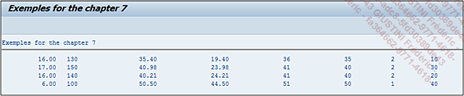

# **FONCTIONS ARITHMETIQUES**

Là encore, il en existe plusieurs :

- Valeur absolue du nombre ou de l'expression définis par `arg`.

```JS
abs( arg )
```

- Arrondi d'un nombre à virgule ou expression `arg` à l'entier inférieur.

```JS
ceil( arg )
```

- Arrondi d'un nombre à virgule ou expression `arg` à l'entier supérieur.

```JS
floor( arg )
```

- Partie entière de la division entre `arg1` et `arg2`.

```JS
div( arg1,arg2 )
```

- Reste de la division entre `arg&` et `arg2`.

```JS
mod( arg1,arg2 )
```

_Exemple reprenant les différents éléments cités ci-dessus :_

```JS
SELECT toll,
       duration,
       gasol,
       ABS( toll - gasol ) AS abs,    "Valeur absolue
       CEIL( gasol )       AS ceil,   "Arrondi inférieur
       FLOOR( gasol )      AS floor,  "Arrondi supérieur
       DIV( duration,60 )  AS div,    "Division
       MOD( duration,60 )  AS mod     "Reste division
  FROM ztravel
  INTO TABLE @DATA(t_arith).

DATA: s_arith LIKE LINE OF t_arith.

LOOP AT t_arith INTO s_arith.
  WRITE:/ s_arith-toll, s_arith-duration, s_arith-gasol,
          s_arith-abs,  s_arith-ceil,     s_arith-floor,
          s_arith-div,  s_arith-mod.
ENDLOOP.
```

Cette requête va d’abord

- afficher les champs `TOLL`, `DURATION` et `GASOL`

- puis va retourner la `valeur absolue` de la `soustraction` entre `TOLL` et `GASOL`

- `arrondir` la valeur de `GASOL` à l’`entier inférieur`

- puis `supérieur`

- et enfin `compter` le `nombre de minutes` du champ `DURATION (DIV)` et le `reste` de cette `division (MOD)`.

Il est possible de déclarer une [VARIABLE](../../04_Variables/01_Variables.md), [STRUCTURE](../../10_Tables_Internes/01_Tables_Internes.md) ou [TABLE INTERNE](../../10_Tables_Internes/01_Tables_Internes.md) directement avec l’instruction `DATA`. Ainsi avec cette fonction unique, la [TABLE INTERNE](../../10_Tables_Internes/01_Tables_Internes.md) `T_ARITH` sera créée automatiquement avec les types et longueurs de champs nécessaires.

De plus, afin que le résultat soit affiché à l’écran avec un [LOOP](../../11_Instructions_itab/09_Loop/README.md), la [STRUCTURE](../../10_Tables_Internes/01_Tables_Internes.md) `S_ARITH` va être déclarée comme la ligne de la [TABLE INTERNE](../../10_Tables_Internes/01_Tables_Internes.md) `T_ARITH` (`LIKE LINE OF`).

La [TABLE INTERNE](../../10_Tables_Internes/01_Tables_Internes.md) `T_ARITH` étant déclarée dans la requête [SQL](./01_SQL.md), la déclaration de la [STRUCTURE](../../10_Tables_Internes/01_Tables_Internes.md) `S_ARITH` ne pourrait se faire qu’après la requête, car la référence utilisée (`LIKE LINE OF T_ARITH`) est inexistante avant.

Au final, la [TABLE INTERNE](../../10_Tables_Internes/01_Tables_Internes.md) `T_ARITH` contiendra les valeurs suivantes :

| **TOLL** | **DURATION** | **GASOL** | **ABS** | **CEIL** | **FLOOR** | **DIV** | **MOD** |
| -------- | ------------ | --------- | ------- | -------- | --------- | ------- | ------- |
| 16.00    | 130          | 35.40     | 19.40   | 36       | 35        | 2       | 10      |
| 17.00    | 150          | 40.98     | 23.98   | 41       | 40        | 2       | 30      |
| 16.00    | 140          | 30.21     | 24.21   | 41       | 40        | 2       | 20      |
| 6.00     | 100          | 50.50     | 44.50   | 51       | 50        | 1       | 40      |

_Résultat à l'écran_


