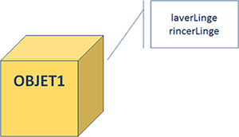
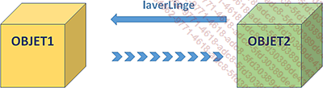

# **ABAP OBJECT**

Ce chapitre est une esquisse de la `programmation orientée objet`, qui est de plus en plus utilisée en **ABAP**. Le sujet étant très étendu et complexe, il est proposé ici d’en voir une définition globale afin de pouvoir la reconnaître dans un programme **ABAP** et de l’utiliser d’une manière simplifiée.

La `programmation orientée objet` se définissait comme un programme non pas découpé en séquences exécutées les unes à la suite des autres, mais divisé en objets communiquant entre eux.

Un objet est défini par des [ATTRIBUTS](../02_Caractéristiques/05_Attributs.md) et des [METHODES](../03_Méthodes/01_Méthodes.md). Il avait été pris comme exemple une machine à laver (représentée dans le schéma ci-dessous par `OBJET1`). Les caractéristiques de la machine à laver (ou [ATTRIBUTS](../02_Caractéristiques/05_Attributs.md)) pourraient être la marque et le modèle, et ses [METHODES](../03_Méthodes/01_Méthodes.md) (ou traitements) seraient de laver, rincer...

Un autre objet connaissant les caractéristiques de l’objet de la machine à laver pourrait interagir avec lui et ils communiqueraient alors entre eux à travers les différents traitements.

Par exemple, une fois que l’identifiant de `OBJET1` (la machine à laver) est connu, `OBJET2` va lui envoyer un message avec un traitement (laverLinge) et les paramètres à exécuter, puis une fois terminé, `OBJET1` enverra le statut du traitement à `OBJET2`.

L’avantage de la _programmation orientée objet_ est celui de concevoir un code plus clair, mieux organisé et structuré, pouvant évoluer avec la demande en ciblant précisément les parties à modifier et donc en limitant les risques d’erreurs et de régression.

Il serait intéressant de voir maintenant comment la _programmation orientée objet_ est caractérisée sur SAP, et pour commencer il est nécessaire de connaître la classe.
