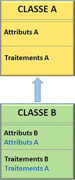
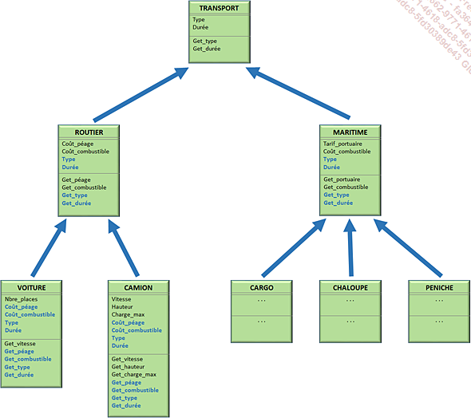
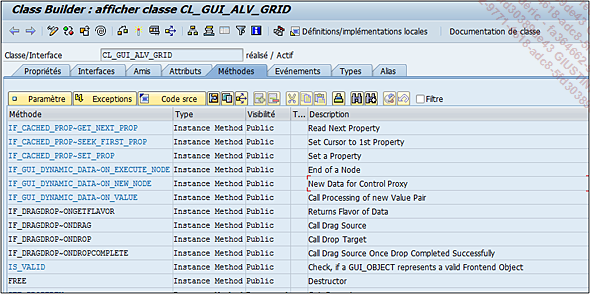
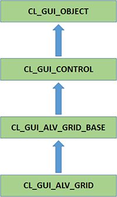
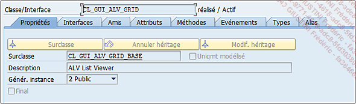
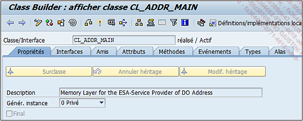
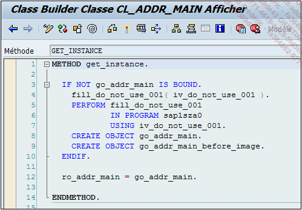
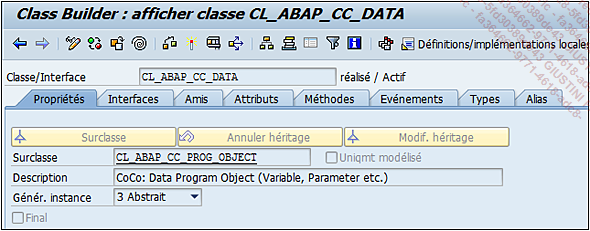

# **PROPRIETES**

Tout d’abord, les propriétés de la _classe_ commencent par définir l’_héritage_ de la _classe_, si elle en possède un, en affichant le nom de sa _surclasse_. Une notion très importante à savoir sur la _programmation orientée objet_, et donc des _classes_, est celle de l’_héritage_, schématisée de la façon suivante :

la `CLASSE A` contenant des _attributs_ et des traitements, possède une `sous-classe` `CLASSE B`, contenant également des _attributs_ et des traitements. De par l’_héritage_, cette dernière va également hériter des _attributs_ et des traitements de la `CLASSE A` représentés en bleu.

Avec un exemple un peu plus parlant, il serait possible d’imaginer une classe `TRANSPORT` ayant deux `sous-classes` : `ROUTIER` et `MARITIME`. La première a elle-même deux autres `sous-classes` (`VOITURE` et `CAMION`) et la deuxième trois (`CARGO`, `CHALOUPE` et `PENICHE`). Ainsi en lisant le schéma de bas en haut, `VOITURE` et `CAMION` possèdent la `surclasse` `ROUTIER` qui possède la `surclasse` `TRANSPORT`. Celle-ci n’ayant pas de `surclasse`, elle est définie comme `superclasse`.

Ainsi, chaque `sous-classe` va hériter des _attributs_ et des méthodes de la `surclasse` qui, comme déjà indiqué, vont apparaître en bleu comme dans l’_éditeur de classes_.

Dans l’exemple, la `classe CL_GUI_ALV_GRID` possède la `surclasse CL_GUI_ALV_GRID_BASE` qui elle-même possède la `surclasse CL_GUI_CONTROL`, qui possède la `surclasse CL_GUI_OBJECT`, qui est enfin la `superclasse` (il suffit de double cliquer à chaque fois sur la _surclasse_ pour arriver à ses propriétés).

Pour revenir à la `classe CL_GUI_ALV_GRID`, il suffit de cliquer plusieurs fois sur le `bouton Retour` (ou raccourci-clavier [F3]) pour revenir en arrière ; dans les propriétés de cette _classe_, on retrouve une autre notion importante de l’objet : l’`instanciation`.

Il s’agit de l’action d’`instancier`, de créer un objet. Dans un _programme ABAP_, l’`instruction CREATE OBJECT` est utilisée pour effectuer cette tâche. Cependant, les options d’instanciation d’une _classe_ sont les suivantes :

**Privé** : l’objet ne peut être créé que par la _classe_ elle-même.

_Exemple_

La _classe_ `CL_ADDR_MAIN` possède une option d’instanciation à privé et l’objet est créé dans la méthode `GET_INSTANCE` de cette même _classe_, il n’est pas possible de le créer directement dans un _programme ABAP_.

**Protégé** : C’est la même chose que privé sauf que l’objet peut être appelé par la _classe_ elle-même ou ses _sous-classes_.

_Exemple_

La `classe CL_BS_API_ADDRESS` possède la `sous-classe CL_BS_API_ADDRESS_MDG`. En créant l’objet de la `classe CL_BS_API_ADDRESS_MDG` via sa `méthode CONSTRUCTOR`, l’objet de la `classe CL_BS_API_ADDRESS` sera également créé automatiquement (appel de sa `méthode CONSTRUCTOR` via la `commande super->constructor`, comme illustré ci-dessous).

> La `méthode CONSTRUCTOR` citée plusieurs fois précédemment est l’endroit où se crée et se définit l’objet d’une classe ; elle est appelée automatiquement via l’`instruction CREATE OBJECT`. Cette notion sera un peu plus développée dans la section suivante sur les méthodes.

Dans l’onglet des propriétés se trouvent également toutes les informations sur la classe de développement, la date de création, de modification...
