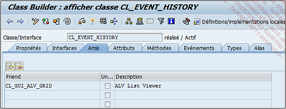

# **AMIS**

Définir un ami permet de lui donner accès à tous les _attributs_, [METHODES](../03_Méthodes/01_Méthodes.md)... d’une _classe_.

_Exemple_

La `classe CL_EVENT_HISTORY` possède comme `ami CL_GUI_ALV_GRID`.

Ainsi, la `classe CL_GUI_ALV_GRID` peut accéder aux données de la `classe CL_EVENT_HISTORY` sans aucune restriction.

Cependant, `"l’amitié n’est ni héritée, ni transitive, ni réciproque"`, ce qui signifie que la ou les `sous-classes amies ne peuvent pas accéder aux attributs de la classe principale ni les amis de la classe amie, et que cela ne donne aucun privilège à la classe principale sur la classe amie`.
