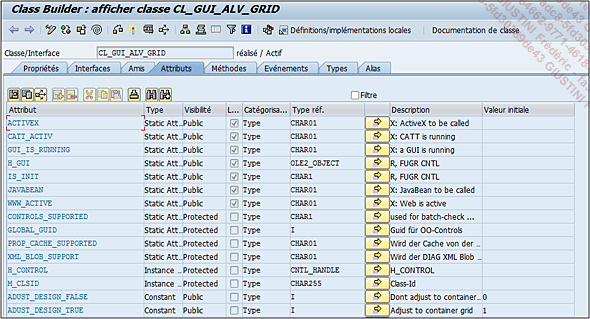

# **ATTRIBUTS**

Les attributs regroupent les différentes variables, constantes... de la classe. Les informations les caractérisant sont les suivantes :

- `Attribut` :

  nom de l’attribut.

- `Type` :

  définit le type de l’attribut et peut prendre les valeurs suivantes :

  - `Instance Attribute` :

    (attribut d’instance) correspondant au `DATA` dans un programme **ABAP**.

  - `Static Attribute` :

    (attribut statique) permet de déclarer une _classe_ ou une _interface_ comme attribut.

  - `Constant` :

    (constante) correspond au [CONSTANTES](../../04_Variables/02_Constants.md) dans un _programme ABAP_.

- `Visibilité` :

  définit la visibilité de la variable, à savoir :

  - `Public` :

    (publique) : la variable est _visible_ par tous aussi bien dans la classe même (ainsi que ses amis), que par les héritiers, mais aussi par les objets techniques externes (_classes_, _interfaces_, _programmes ABAP_, [FONCTIONS](../../13_Fonctions/README.md)...).

  - `Protected` :

    (protégé) : la variable est _visible_ dans la _classe_ même (ainsi que ses amis), par les héritiers, mais pas par les objets techniques externes (_classes_, _interfaces_, _programmes ABAP_, [FONCTIONS](../../13_Fonctions/README.md)...).

  - `Private` (privé) :

    la variable n’est _visible_ que par la _classe_ même ainsi que ses amis, mais ni par ses héritiers ni par les objets techniques externes (_classes_, _interfaces_, _programmes ABAP_, [FONCTIONS](../../13_Fonctions/README.md)...).

- `Lecture` :

  définit si la variable est en _lecture seule_ ou peut être _modifiable_.

- `Catégorisation` :

  là aussi, peut prendre différentes valeurs comme déjà vu dans les chapitres précédents (notamment _Instructions basiques ABAP_ - [VARIABLES](../../04_Variables/01_Variables.md) et [CONSTANTES](../../04_Variables/02_Constants.md) et [DDIC](../../08_SE11/README.md)) :

  - `Like` :

    fait référence indirectement au type d’une autre [VARIABLE](../../04_Variables/01_Variables.md), [CONSTANTE](../../04_Variables/02_Constants.md)...

  - `Type` :

    fait référence à un type de données (en général, un [ELEMENT DE DONNEES](../../08_SE11/07_Elements_de_Donnees.md)).

  - `Type Ref To` :

    fait référence au type de référence défini dans l’[ELEMENT DE DONNEES](../../08_SE11/07_Elements_de_Donnees.md) ou à une _classe_ ou une _interface_.

  - `Type... Boxed` :

    même chose que `Type` sauf que le champ, ayant une valeur initiale définie, aura une mémoire qui lui sera allouée seulement lors d’un changement de cette valeur au contraire d’un champ Type qui, lui, aura une mémoire allouée dès le début du traitement.

- `Type réf.` :

  sera renseigné avec le nom de la référence.

- La `flèche dans la colonne suivante` :

  permettra de renseigner directement les caractéristiques de l’attribut dans un _éditeur ABAP_.

- `Description`

- `Valeur initiale` :

  obligatoire pour les _attributs_ de type [CONSTANTE](../../04_Variables/02_Constants.md).
