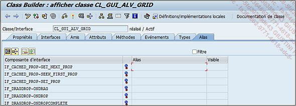

# **ALIAS**

Lorsqu’une _classe_ utilise une _interface_ (onglet du même nom), les [METHODES](../03_Méthodes/01_Méthodes.md) de celle-ci sont importées automatiquement. Pour faciliter leur appel, il est possible de leur attribuer un alias :

- `Composante d’interface` :

  est le nom de la composante automatiquement importée.

- `Type` :

  est celui de la composante. Dans cet exemple, l’icône signifie qu’il s’agit d’une [METHODE](../03_Méthodes/01_Méthodes.md).

- `Alias` :

  est celui qui lui sera attribué ou non.

- `Visibilité`.

