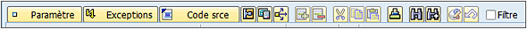
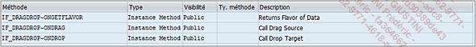
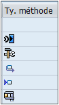

# **METHODES**

Les _méthodes_ sont des traitements membres d'une _classe_ agissant sur un _objet_ ou non. Dans l'onlet correspondant de l'_éditeur de classe_, les _méthodes_ sont listées en suivant toujours la règle : celles en bleu viennent d'un héritage et celles en noir sont spécifiques à la _classe_.



- `Paramètre` sera détaillé dans la suite de cette section.

- `Exceptions` sera détaillée dans la suite de cette section.

- `Code srce` sera détaillées dans la suite de cette section.

- `Propriétés de la méthode`

- `Documentation` de la _méthode_

- `Cas d’emploi`

- `Insérer` une _méthode_

- `Supprimer `une _méthode_

- `Couper`

- `Copier`

- `Coller`

- `Trier` l’ordre d’affichage des _méthodes_

- `Rechercher` des noms de _méthodes_

- `Continuer` la recherche

- `Redéfinir la méthode` permet pour des _sous-classes_ de redéfinir une _méthode_ héritée et de l’adapter à la _classe_ qui a hérité.

- `Supprimer` la redéfinition va annuler la redéfinition de la _méthode_ héritée.

- `Filtre` permet d’afficher (case décochée) ou de masquer (case cochée) les _méthodes_ héritées, assurant ainsi une meilleure visibilité.

Vient ensuite une liste des _méthodes_ de la classe dont les caractéristiques principales se présentent sous cette forme :



- `Méthode` (nom de la _méthode_)

- `Type` pouvant être :

  - `INSTANCE METHOD`

    `Instance method` (_méthode_ d’instance) : pour ce genre de _méthode_, il est nécessaire de générer l’instance de la classe via l’instruction CREATE OBJECT et une variable d’objet faisant référence à cette classe.

    _Exemple avec la classe `CL_GUI_ALV_GRID` et l’appel de la méthode `SET_TABLE_FOR_FIRST_DISPLAY` :_

    ```JS
    DATA: o_alv TYPE REF TO cl_gui_alv_grid.

    CREATE OBJECT o_alv...

    CALL METHOD o_alv->set_table_for_first_display
      EXPORTING
        ...
      CHANGING
        ...
      EXCEPTIONS
        ...
    ```

  - `STATIC METHOD`

    `Static method` (méthode statique) pour ce genre de méthode, nul besoin de générer l’instance, la méthode peut être appelée directement.

    _Exemple avec la classe `CL_GUI_ALV_GRID` et la méthode `CELL_DISPLAY` :_

    ```JS
    CALL METHOD cl_gui_alv_grid=>cell_display
      EXPORTING
        ...
      IMPORTING
        ...
      CHANGING
        ...
    ```

- `Visibilité` : même définition que pour les _attributs_.

- `Type de méthode` indique pour certaines _méthodes_ s’il s’agit (dans l’ordre) de _méthode_ :

  - `Normale` (vide)

  - `Traitement d’événement`

  - `Type constructeur`, `constructeur de classe` ou `destructeur`

  - `GET`

  - `SET`

  - `Test`

  

- `Description`

Comme indiqué précédemment, les trois options `Paramètre`, `Exceptions` et `Code Srce` vont permettre de définir la _méthode_.

Pour la suite de ce chapitre, la _méthode_ `SET_TABLE_FOR_FIRST_DISPLAY` sera utilisée comme exemple. C’est celle-ci qui est appelée pour afficher le [RAPPORT ALV](../../16_ALV/README.md).
