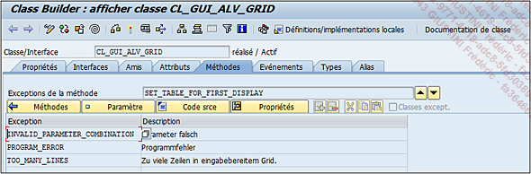

# **EXCEPTIONS**

Les _exceptions_ d’une [METHODE](./01_Méthodes.md) se comportent exactement de la même façon que les _exceptions_ d’un [MODULE FONCTION](../../13_Fonctions/README.md). Lors de l’appel de la [METHODE](./01_Méthodes.md), la liste des _exceptions_ pourra être retournée et traitée par un message d’erreur adéquat.



_Exemple_

```JS
DATA: o_alv TYPE REF TO cl_gui_alv_grid.
DATA: t_outtab TYPE TABLE OF zdriver_car.

CALL METHOD o_alv->set_table_for_first_display
*  EXPORTING
*    i_buffer_active               =
*    i_bypassing_buffer            =
*    i_consistency_check           =
*    i_structure_name              =
*    is_variant                    =
*    i_save                        =
*    i_default                     = 'X'
*    is_layout                     =
*    is_print                      =
*    it_special_groups             =
*    it_toolbar_excluding          =
*    it_hyperlink                  =
*    it_alv_graphics               =
*    it_except_qinfo               =
*    ir_salv_adapter               =
  CHANGING
    it_outtab                     = t_outtab
*   it_fieldcatalog               =
*   it_sort                       =
*   it_filter                     =
  EXCEPTIONS
    invalid_parameter_combination = 1
    program_error                 = 2
    too_many_lines                = 3
    OTHERS                        = 4.
IF sy-subrc <> 0.
  CASE sy-subrc.
    WHEN 1.
      WRITE:/ 'Les paramètres utilisés sont erronés'.
    WHEN 2.
      WRITE:/ 'Erreur de programme'.
    WHEN 3.
      WRITE:/ 'Trop de lignes dans la table de données.
Le rapport ALV ne peut pas les afficher.'.
    WHEN OTHERS.
      WRITE:/ 'Une erreur inatendue a été retournée'.
  ENDCASE.
ENDIF.
```

L’`objet O_ALV` est tout d’abord déclaré et fait référence à la `classe CL_GUI_ALV_GRID`. La `table interne T_OUTTAB` est ensuite déclarée (unique paramètre obligatoire de la méthode).

Le programme va ensuite appeler la `méthode SET_TABLE_FOR_FIRST_DISPLAY` et va traiter les _exceptions_ en lisant la variable système de code retour [SY-SUBRC](../../help/02_SY-SYSTEM.md).

    Ce programme est juste un exemple et ne peut pas fonctionner. En effet, l’appel de la méthode SET_TABLE_FOR_FIRST_DISPLAY se fait avec l’objet O_ALV, mais celui-ci n’a pas été créé avec l’instruction CREATE OBJECT.
