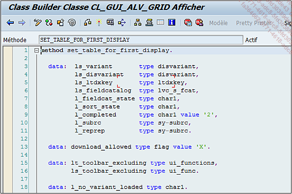
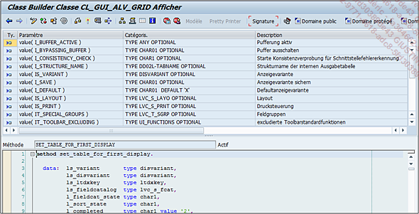
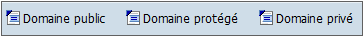

# **CODE SOURCE**

Le bouton `Code Source` permet d’accéder à la dernière section où la [METHODE](./01_Méthodes.md) est implémentée.

La barre d’outils possède les mêmes fonctionnalités que celle de l’_éditeur ABAP_.

Le bouton `Signature` est bien utile, car il affiche ou masque la liste des paramètres de la [METHODE](./01_Méthodes.md), facilitant ainsi le développement.

Les trois derniers boutons `Domaine public`, `Domaine protégé`, et `Domaine privé`, permettent de naviguer entre les différentes parties de la _classe_, qui possède un _code source_ pour chaque _visibilité_.

