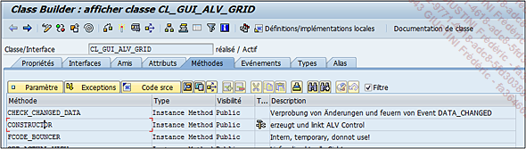
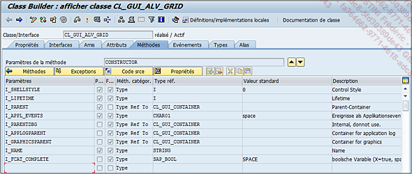
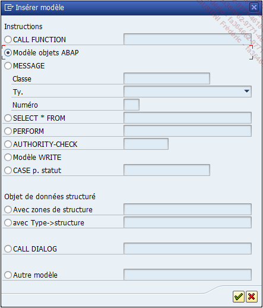
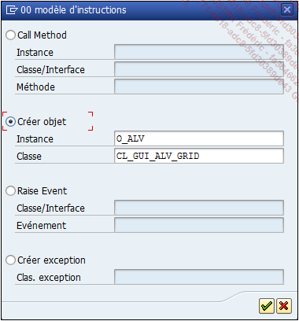

# **CONSTRUCTOR**

Comme indiqué dans ce chapitre, l’_objet_ se crée grâce à l’_instruction_ :

```JS
CREATE OBJECT class...
```

Bien entendu en prenant en compte que la `classe class` n’ait pas une instanciation de `type privé`.

Lorsque cette _instruction_ est exécutée, une [METHODE](./01_Méthodes.md) de la `classe class` est obligatoirement appelée : le `CONSTRUCTOR`. Comme son nom l’indique, cette [METHODE](./01_Méthodes.md) va générer l’instance de la classe via une variable d’objet. Quelques règles existent pour une [METHODE](./01_Méthodes.md) de _type constructeur_ :

1. Une classe ne peut avoir qu’une seule [METHODE](./01_Méthodes.md) de type constructeur.

2. Le _constructeur_ doit être de _type public_.

3. Les paramètres du _constructeur_ ne seront que de _type importation_.

Exemple avec la `méthode CONSTRUCTOR` de la classe `CL_GUI_ALV_GRID`.



Les paramètres de la `méthode CONSTRUCTOR` vont donc être les suivants (il est intéressant de voir que le type de paramètre (`Importation`, `Exportation`...) ne peut pas être spécifié) :



Lorsqu’elle sera appelée, un seul paramètre sera obligatoire.

Bien entendu, dans l’_éditeur ABAP_, il est également possible d’utiliser la fonctionnalité _Modèle_ pour importer les paramètres obligatoires de n’importe quel _constructeur_ de n’importe quelle _classe_.

Exemple avec la création de l’_objet_ de la `classe CL_GUI_ALV_GRID`. Tout d’abord, la variable d’_objet_ va être créée.

```JS
DATA: o_alv TYPE REF TO cl_gui_alv_grid.
```

Puis avec l’`option Modèle`, l’`option Modèle objet ABAP` devra être choisie.



L’`option Créer objet` sera sélectionnée avec les champs suivants :



Et comme avec les fonctions, l’_instruction_ est automatiquement importée avec tous les _paramètres en entrée_ (obligatoires ou non), les _exceptions_...

```JS
DATA: o_alv TYPE REF TO cl_gui_alv_grid.

CREATE OBJECT o_alv
  EXPORTING
*    i_shellstyle      = 0
*    i_lifetime        =
     i_parent          =
*    i_appl_events     = space
*    i_parentdbg       =
*    i_applogparent    =
*    i_graphicsparent  =
*    i_name            =
*    i_fcat_complete   = SPACE
*  EXCEPTIONS
*    error_cntl_create = 1
*    error_cntl_init   = 2
*    error_cntl_link   = 3
*    error_dp_create   = 4
*    others            = 5
    .
IF sy-subrc <> 0.
* MESSAGE ID SY-MSGID TYPE SY-MSGTY NUMBER SY-MSGNO
*            WITH SY-MSGV1 SY-MSGV2 SY-MSGV3 SY-MSGV4.
ENDIF.
```
