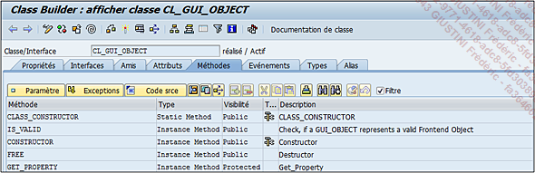

# **CONSTRUCTEUR DE CLASSE**

Il existe un autre _type de constructeur_ conçu pour la _classe_ : la `méthode CLASS_CONSTRUCTOR`. Elle ne peut être appelée qu’une seule fois par programme, avant la première utilisation de la _classe_ et donc en général avant une des étapes suivantes :

- _Instanciation de la classe_ (`CREATE OBJECT`).

- Utilisation d’un _attribut statique_.

- Appel d’une [METHODE](./01_Méthodes.md) _statique_.

- Utilisation d’un _événement_ d’une _classe_.

> Pour rappel, les attributs et méthodes statiques peuvent être appelés directement, nul besoin de générer une instance d’objet.

Quelques règles existent pour une [METHODE](./01_Méthodes.md) de _type constructeur de classe_ :

1. Une _classe_ ne peut détenir qu’un _constructeur de classe_.

2. Le _constructeur de classe_ doit être de _type public_.

3. Le _constructeur de classe_ ne peut pas gérer de _paramètres_, ni même d’_exceptions_.

4. Il est impossible de l’appeler explicitement.

Exemple avec la `classe CL_GUI_OBJECT` contenant à la fois une `méthode CONSTRUCTOR` et `CLASS_CONSTRUCTOR`.

