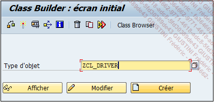
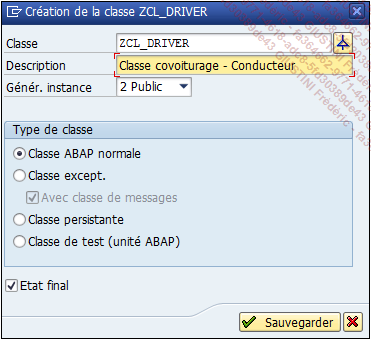
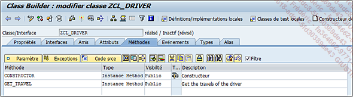
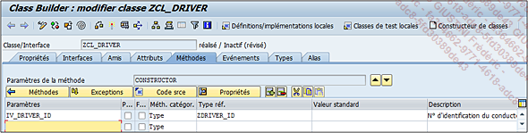
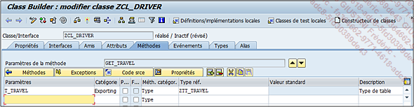
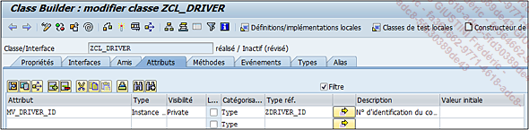
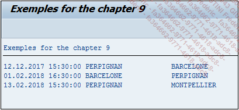

# **CREATION D'UNE CLASSE**

Le but de cette partie sera simplement de créer une _classe_ simple avec deux [METHODES](../03_Méthodes/01_Méthodes.md) :

- une [METHODE](../03_Méthodes/01_Méthodes.md) `CONSTRUCTOR`

- une [METHODE](../03_Méthodes/01_Méthodes.md) effectuant une sélection dans la `table ZDRIVER_CAR`

1. Ouvrez l’_éditeur des classes_ via la `transaction SE24`.

   > Pour rappel, il est possible d’y accéder par ces différents moyens : depuis n’importe quel écran, en renseignant la transaction dans la zone de commande et en spécifiant si elle doit être exécutée dans une même session (/nSE24) ou dans une nouvelle (/oSE24), ou à partir de la fenêtre d’accueil, dans le menu SAP par un double clic sur la ligne Class Builder (éditeur de classe) ou par un clic droit puis Exécuter : Class Builder.

2. Dans la fenêtre d’accueil de l’éditeur, renseignez le nom de la classe à créer (`ZCL_DRIVER` par exemple), puis cliquez sur le bouton `Créer`.

   

3. Dans la fenêtre des propriétés, renseignez une description et laissez Génér. `Instance` à `Public`, le `Type de classe` à `Classe ABAP normale` et l’option `Etat final` cochée (empêchant de ce fait de créer une sous-classe), puis cliquez sur `Sauvegarder`.

   

4. Dans la nouvelle fenêtre pop-up, renseignez une classe de développement ou créez-la comme objet local.

5. Deux [METHODES](../03_Méthodes/01_Méthodes.md) vont être créées :

   

   - `CONSTRUCTOR`

     - `Type` : Instance Method

     - `Visibilité` : Public

     - `Description` : Constructeur

     - `Paramètre` :

       - Nom : IV_DRIVER_ID

       - Passage par val. et facultatif non cochés

       - Méth. catégor. : Type

       - Type réf. : ZDRIVER_ID

   

   - `GET_TRAVEL`

     - `Type` : Instance Method

     - `Visibilité` : Public

     - `Description` : Get the travels of the driver

     - `Paramètre` :

       - Nom : T_TRAVEL

       - Catégorie : Exporting

       - Passage par val. et facultatif non cochés

       - Méth. catégor. : Type

       - Type réf. : ZTT_TRAVEL

   

   La référence de `TT_TRAVEL` est le type de table de `ZTRAVEL`, à savoir `ZTT_TRAVEL`.

   - Exception si aucune donnée n’est trouvée

   - Nom : NO_DATA_FOUND

   - Description : No data found

6. Dans l’onglet `Attributs`, créez une variable qui ira stocker la valeur passée dans le constructeur :

- `Attribut` : MV_DRIVER_ID

- `Type` : Instance Attribute

- `Visibilité` : Private

- `Catégorisation` : Type

- `Type réf.` : ZDRIVER_ID



7. Il va falloir maintenant implémenter le code source du `CONSTRUCTOR` en alimentant l’attribut `MV_DRIVER_ID` avec le paramètre d’entrée du constructeur et ainsi pouvoir l’utiliser dans les autres [METHODES](../03_Méthodes/01_Méthodes.md) sans l’importer à chaque fois.

```JS
METHOD constructor.

  mv_driver_id = iv_driver_id.

ENDMETHOD.
```

8. L’implémentation de la [METHODE](../03_Méthodes/01_Méthodes.md) `GET_TRAVEL` sélectionnera dans la table `ZTRAVEL` toutes les lignes dont le champ `ID_DRIVER` sera égal à `MV_DRIVER_ID` et alimentera la table de sortie `T_TRAVEL`.

```JS
METHOD get_travel.

  SELECT * FROM ztravel
    INTO TABLE t_travel
    WHERE id_driver = mv_driver_id.

ENDMETHOD.
```

9. Activez la classe, elle est maintenant prête pour être utilisée dans un programme.

_Exemple d’utilisation de la classe dans un programme_

```JS
DATA: t_travel TYPE TABLE OF ztravel,
      s_travel TYPE ztravel.

DATA: o_driver TYPE REF TO zcl_driver.

CONSTANTS: c_driver_id TYPE zdriver_id VALUE 'C0003'.


CREATE OBJECT o_driver
  EXPORTING
    iv_driver_id = c_driver_id.


CALL METHOD o_driver->get_travel
  IMPORTING
    t_travel      = t_travel
  EXCEPTIONS
    no_data_found = 1
    OTHERS        = 2.


IF sy-subrc = 1.
  WRITE: / 'Aucune donnée retournée'.
ELSE.

  LOOP AT t_travel INTO s_travel.
    WRITE: / s_travel-date_travel,
             s_travel-hour_travel,
             s_travel-city_from,
             s_travel-city_to.
  ENDLOOP.

ENDIF.
```

`Déclaration` : une [TABLE INTERNE](../../10_Tables_Internes/README.md) `T_TRAVEL` et une structure `S_TRAVEL` de référence `ZTRAVEL`, une variable d’objet `O_DRIVER` utilisant la _classe_ `ZCL_DRIVER` comme référence, et enfin une [CONSTANTE](../../04_Variables/02_Constants.md) de type `ZDRIVER_ID` avec comme valeur `C003`.

Instanciation de la _classe_ avec comme paramètre la [CONSTANTE](../../04_Variables/02_Constants.md), puis appel de la [METHODE](../03_Méthodes/01_Méthodes.md) `GET_TRAVEL` pour retourner les enregistrements de la table `ZTRAVEL`.

Si aucune erreur n’est retournée par la [METHODE](../03_Méthodes/01_Méthodes.md), [BOUCLE](../../11_Instructions_itab/09_Loop/README.md) sur la [TABLE INTERNE](../../10_Tables_Internes/README.md) et affichage des valeurs.

_Résultat à l’écran_


