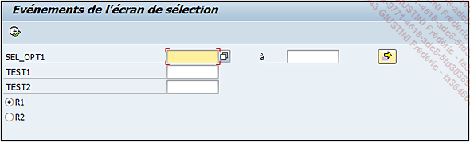
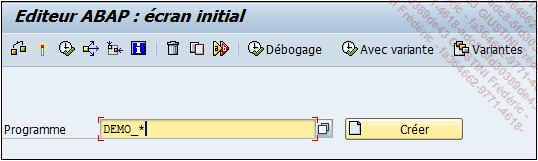
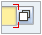
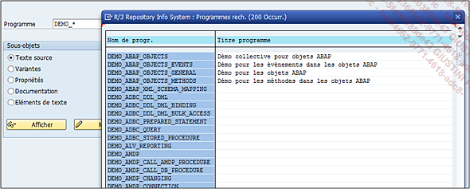
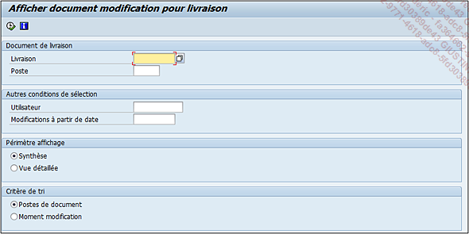

# **ECRAN DE SELECTION**

Dans ce chapitre, un exemple plus complexe sera développé avec l’affichage de données dans un [REPORT ALV](../../16_ALV/08_Rapport_ALV.md).

Pour commencer, il serait intéressant de connaître l’_écran de sélection_. Il s’agit de l’écran d’accueil permettant à l’_utilisateur_ d’insérer des données utilisées pour filtrer les [SELECTIONS](../02_Champs/README.md) qui se feront plus tard dans le programme.

Exemple d’_écran de sélection_ sans mise en forme du `programme DEMO_SELECTION_SCREEN_EVENTS`.

    Il existe des exemples de programmes mis à disposition par SAP et ils commencent en général par DEMO. Sur SAP, pour afficher une liste à partir de mots-clés, il suffit d’appuyer sur la touche [F4] une fois ce mot-clé renseigné.

_Exemple_

Connaître la liste de tous les programmes commençant par `DEMO*` :

- Exécutez la [TRANSACTION `SE38`]() (dans le cas d’une recherche d’un nom de programme).

- Dans la zone Programme, renseignez `DEMO*` signifiant qu’on recherche tous les noms de programmes commençant par `DEMO*` suivi d’une chaîne de caractères (symbolisée par `*`)

- Appuyez ensuite sur [F4] ou le bouton d’aide à la recherche du champ .png.

- La liste des programmes va alors s’afficher, il suffira de double cliquer dessus pour pouvoir y accéder.

Pour revenir à l’_écran de sélection_, il est bien sûr possible de le rendre plus lisible et mieux organisé.

_Exemple_

_Écran de sélection du programme de modification des documents de livraison (transaction VL22)._

Il sera vu dans cette section les principales options utilisées pour la création d’un _écran de sélection_ simple.
