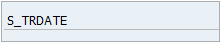

# **SELECT-OPTIONS**

```JS
SELECT-OPTIONS selcrit FOR dobj
       [OBLIGATORY]
       [DEFAULT val]
       [MATCHCODE OBJECT search_help].
```

Le `SELECT-OPTIONS` permet de définir une plage de _sélection_ pouvant aller d’une _valeur unique_ à un _intervalle de valeurs_ (inclusion comme exclusion).

L’instruction `SELECT-OPTIONS` est suivie du nom de la _variable_ `selcrit` (sur au maximum huit (8) positions), puis le `FOR` fait référence à une table et son _champ_.

_Exemple_

_Champ de la date de voyage `DATE_TRAVEL` de la table `ZTRAVEL`._

```JS
SELECT-OPTIONS s_trdate FOR ztravel-date_travel.
```

Cependant, l'instruction est incomplète, car pour le `SELECT-OPTIONS`, la [TABLE](../../09_Tables_DB/README.md) qui va être utilisée doit être déclarée en amont avec la commande `TABLES`.

```JS
TABLES: ztravel.

SELECT-OPTIONS s_trdate FOR ztravel-date_travel.
```

Lorsque le programme est exécuté, l’écran suivant est affiché :


Le champ défini par le `SELECT-OPTIONS` apparaît bien et lorsque le bouton `Sélection`  est cliqué, une fenêtre pop-up apparaît pour affiner les critères de recherche et donc la possibilité de :

- Inclure une _liste de valeurs uniques_ et/ou

- Inclure une _liste d’intervalles de valeurs_ et/ou

- Exclure une _liste de valeurs_ et/ou

- Exclure une _liste d’intervalles de valeurs_


Une barre d'outils se situant en dessous des _sélections_ contient les fonctionnalités suivantes :


- `Reprendre` [F8] pour valider la _sélection_ et retourner à l’écran précédent.

- `Contrôler entrées` [Entrée] vérifie les valeurs attribuées.

- `Gestion des options de sélection` [F2] définit les options de la valeur (égal, différent, strictement supérieur, strictement inférieur...).

- `Insérer une ligne` [Maj+F1] permet de rajouter une ligne dans une liste de valeurs.

- `Supprimer ligne de sélection` [Maj+F2] permet de supprimer une ligne dans une liste de valeurs.

- `Supprimer toute la sélection` [Maj+F4] efface tous les éléments sélectionnés.

- `Aide sur écran` [Maj+F6].

- `Import de fichier texte` [Maj+F11] pour insérer une liste de valeur à partir d’une source.

- `Charger du presse-papiers` [Maj+F12] ajoute toutes les valeurs contenues dans le presse-papiers (exemple copie de toutes les données de la colonne DRIVER_ID de la table ZDRIVER_CAR, cette option va permettre de les coller).

- `Interrompre` [F12] sortie de la fenêtre de la _sélection multiple_.

Cependant, dans l’[ECRAN DE SELECTION](../01_Ecran_de_Sélection/README.md), le titre du _champ_ apparaît avec le nom technique.



Pour le rendre lisible, il faut retourner à l’_éditeur ABAP_ (raccourci-clavier [F3] ou flèche sur fond vert dans la barre de commande) et dans les menus déroulants, choisir le chemin suivant :

Saut - Éléments de texte - Textes de sélection


L'écran de texte va alors s'afficher. Ici seront affichés tous les _champs_ de l'[ECRAN DE SELECTION](../01_Ecran_de_Sélection/README.md) et dans la colonne `Texte`, il sera possible de leur attribuer un titre. Dans cet exemple, nous choisirons `Date`.


L'option `Réf. dictionnaire` indique à l'éditeur de faire référence directement au titre de l'élément de texte qui sera automatiquement importé.


Une fois ces changements effectués, il faudra _sauvegarder_ puis _activer_.

Lorsque le programme est exécuté de nouveau, le _champ_ est toujours affiché, mais cette fois avec le titre adéquat.


Il existe des options pour le `SELECT-OPTIONS` :

1. `OBLIGATORY` :

   Rend le _champ_ obligatoire.

   _Rendre le champ `S_TRDATE` obligatoire`._

   ```JS
   TABLES: ztravel.

   SELECT-OPTIONS s_trdate FOR ztravel-date_travel OBLIGATORY.
   ```

   

   Sur **SAP**, les zones marquées par une petit coche comme sur l'exemple ci-dessus sont obligatoires et doivent être renseignées, sinon le programme retournera un message d'erreur.

2. `DEFAULT val`

   Assigne une valeur initiale au _champ_.

   _Définir la valeur initiale du champ `S_TRDATE` avec la date système [SY-DATUM](../../help/02_SY-SYSTEM.md)_

   ```JS
   TABLES: ztravel.

   SELECT-OPTIONS s_trdate FOR ztravel-date_travel DEFAULT sy-datum.
   ```

   

   > En ajoutant un deuxième champ, il a rajouté `:` après le `SELECT-OPTIONS`, et les champs sont séparés par une virgule `,`.

Comme indiqué dans le chapitre sur les [TABLES INTERNES](../../10_Tables_Internes/README.md), le _champ_ d'un `SELECT-OPTIONS` aura la structure d'un [RANGE](../../10_Tables_Internes/05_Type_Range.md) à savoir :

- `SIGN` de type `C` (alphanumérique) et de longueur 1, accepte les valeurs :

  - `I` Inclure

  - `E` Exclure

- `OPTION` de type `C` (alphanumérique) et de longueur 2, contient les valeurs définies dans les [INSTRUCTIONS CONDITIONNELLES](../../05_Conditions/README.md)

  - `EQ` = Egal

  - `NE` = Différent (Not Equal)

  - `GT` = Strictement plus grand que (Greater Than)

  - `GE` = Plus grand ou Egal (Greater or Equal)

  - `LE` = Inférieur ou Egal (Less or Equal)

  - `LT` = Strictement inférieur (Less Than)

  - `BT` = Entre (Between)

  - `NB` = En dehors (Not Between)

- `LOW`, intervalle inférieur dont le type et la longueur de _champ_ varient selon la référence attribuée avec le `FOR`.

- `HIGH`, intervalle supérieur dont le type et la longueur de _champ_ varient selon la référence attribuée avec le `FOR`.

Pour la requête SQL, le SELECT utilisera ces intervalles de valeurs avec l’instruction IN et le symbole `@` pour indiquer que la valeur se situe en dehors de la _sélection_.

```JS
TABLES: ztravel.

SELECT-OPTIONS: s_trdate FOR ztravel-date_travel
                         OBLIGATORY
                         DEFAULT sy-datum,
                s_driver FOR ztravel-id_driver
                         MATCHCODE OBJECT  zsh_driver.

SELECT date_travel,
       hour_travel,
       id_driver,
       id_user1,
       id_user2,
       id_user3,
       city_from,
       country_from,
       city_to,
       country_to
  FROM ztravel
  INTO TABLE @DATA(t_travel)
  WHERE date_travel IN @s_trdate
    AND id_driver   IN @s_driver.
```
