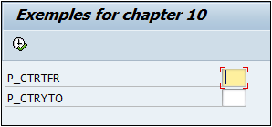
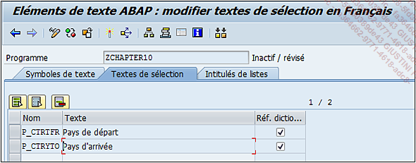
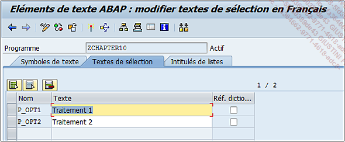
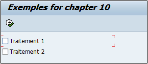
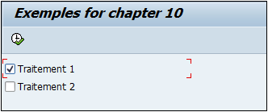
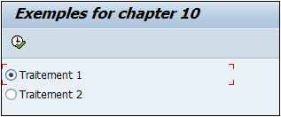
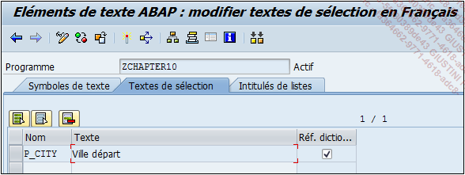
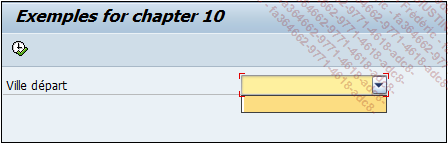

# **PARAMETERS**

```JS
PARAMETERS para { TYPE type
                | LIKE dobj }
           [OBLIGATORY]
           [AS CHECKBOX]
           [RADIOBUTTON GROUP group]
           [AS LISTBOX VISIBLE LENGTH vlen]
           [DEFAULT val]
           [MATCHCODE OBJECT search_help].
```

Au contraire du `SELECT-OPTIONS`, `PARAMETERS` stockera une seule valeur à la fois.

L’instruction `PARAMETERS` est suivie du nom de la variable `para` (sur au maximum huit (8) positions), puis le `LIKE` fait référence à une _table_ et son _champ_ comme le `TYPE` (possible également d’utiliser un élément de données avec ce dernier).

_Exemple_

_Faire un écran de sélection avec les zones `COUNTRY_FROM` et `COUNTRY_TO` de la table `ZTRAVEL` (le premier en utilisant le LIKE et le deuxième le TYPE)._

```JS
PARAMETERS: p_ctrtfr LIKE ztravel-country_from,
            p_ctryto TYPE fpm_ctryto.
```

Avec `PARAMETERS`, il n’est pas nécessaire de déclarer la table `ZTRAVEL` en amont.

Lorsque le programme est exécuté, l’écran suivant est affiché :



Les _champs_ définis par le `PARAMETERS` apparaissent bien. Comme il n’y a pas d’aide à la recherche associée au _champ_ de la _table_ et à l’[ELEMENT DE DONNEES](../../08_SE11/07_Elements_de_Donnees.md), il n’y a pas de fenêtre de dialogue associée au _champ_ pour choisir la valeur. Il sera cependant possible d’utiliser une des options listées un peu plus tard dans cette section.

Comme pour le `SELECT-OPTIONS`, il faut définir les titres des _champs_ en exécutant le menu suivant :

Saut - Éléments de texte - Textes de sélection



- `OPTIONS` pour les `PARAMETERS` :

  - `OBLIGATORY`

  - `DEFAULT val`

  - `MATCHCODE OBJECT` search_help

  - `search_help` et val sont des termes génériques devant être remplacés par une aide à la recherche pour le premier et une variable pour le deuxième.

Ces trois options ont un fonctionnement identique au `SELECT-OPTIONS`.

- `AS CHECKBOX`

  `AS CHECKBOX` définit le paramètre comme case à cocher (comme dans une liste de choix multiples) et sa valeur sera donc égale à `X` (paramètre coché) ou vide (paramètre non coché).

  _Choix de deux options de traitement dans l’écran de sélection et exécution du traitement correspondant._

  ```JS
  PARAMETERS: p_opt1 TYPE char1 AS CHECKBOX,
              p_opt2 TYPE char1 AS CHECKBOX.

  IF p_opt1 = 'X'.
  *  Traitement 1
  ENDIF.

  IF p_opt2 = 'X'.
  *  Traitement 2
  ENDIF.
  ```

  

  

      L'option DEFAULT 'X' permet de définir une option par défaut.

  ```JS
  PARAMETERS: p_opt1 TYPE char1 AS CHECKBOX DEFAULT 'X',
              p_opt2 TYPE char1 AS CHECKBOX.

  IF p_opt1 = 'X'.
  *  Traitement 1
  ENDIF.

  IF p_opt2 = 'X'.
  *  Traitement 2
  ENDIF.
  ```

  

- `RADIOBUTTON GROUP group`

  `RADIOBUTTON GROUP group` transforme les paramètres en bouton radio, regroupés en groupe `group`.

  _Liste de deux boutons radio et exécution du traitement correspondant._

  ```JS
  PARAMETERS: p_opt1 TYPE char1 RADIOBUTTON GROUP grp,
              p_opt2 TYPE char1 RADIOBUTTON GROUP grp.

  IF p_opt1 = 'X'.
  *  Traitement 1

  ELSEIF p_opt2 = 'X'.
  *  Traitement 2

  ENDIF.
  ```

  

      La différence entre le CHECKBOX et le RADIOBUTTON est que la première option autorise un choix multiple alors que la deuxième est restreinte à un seul d’un même groupe.

- `AS LISTBOX VISIBLE LENGTH`

  `AS LISTBOX VISIBLE LENGTH vlen` liste des valeurs pour un _paramètre_.

  _Paramètre de type LISTBOX proposant un choix de valeurs dans une liste de villes._

  ```JS
  PARAMETERS: p_city TYPE ztravel-city_from
                     AS LISTBOX VISIBLE LENGTH 20.
  ```

  

  

  Bien entendu, la liste de valeurs n’est pas importée automatiquement et il est nécessaire d’utiliser l’événement AT `SELECTION-SCREEN OUTPUT` pour la renseigner :

  ```JS
  *Ecran de Sélection
  PARAMETERS: p_city TYPE ztravel-city_from
                     AS LISTBOX VISIBLE LENGTH 20.

  *Evénement
  AT SELECTION-SCREEN OUTPUT.
    DATA: t_list TYPE TABLE OF vrm_value,
          s_list TYPE vrm_value,
          v_name TYPE vrm_id.

    v_name = 'P_CITY'.

    CLEAR s_list.
    s_list-key  = '1'.
    s_list-text = 'BARCELONE'.
    APPEND s_list TO t_list.

    s_list-key  = '2'.
    s_list-text = 'TOULOUSE'.
    APPEND s_list TO t_list.

    s_list-key  = '3'.
    s_list-text = 'PERPIGNAN'.
    APPEND s_list TO t_list.

    CALL FUNCTION 'VRM_SET_VALUES'
      EXPORTING
        id     = v_name
        values = t_list.
  ```

  Cet événement, appelé avant l’affichage de l’[ECRAN DE SELECTION](../01_Ecran_de_Sélection/README.md) (mais aussi une fois que le programme est exécuté), va utiliser trois [VARIABLES](../../04_Variables/01_Variables.md) : l’identifiant du paramètre (`V_NAME`), une [TABLE INTERNE](../../10_Tables_Internes/01_Tables_Internes.md) ainsi que sa structure (`T_LIST` et `S_LIST`) ayant comme référence le type `VRM_VALUE`. La [TABLE INTERNE](../../10_Tables_Internes/01_Tables_Internes.md) va ensuite être remplie avec trois valeurs différentes, puis la [FONCTION](../../13_Fonctions/README.md) `VRM_SET_VALUES` va être appelée pour assigner ces valeurs au champ de l’écran.

  

  Il existe d’autres événements qui seront listés dans la partie suivante.
