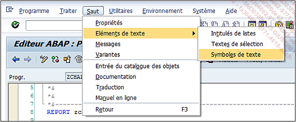
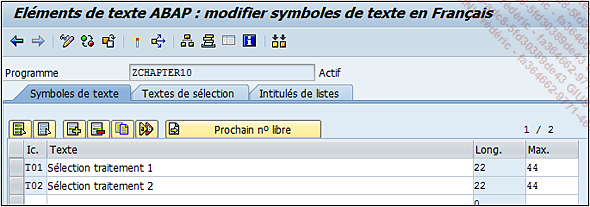
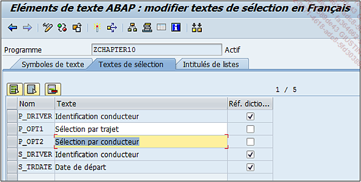
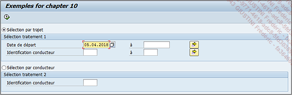

# **ORGANISATION**

Il est possible d’organiser l’[ECRAN DE SELECTION](../01_Ecran_de_Sélection/README.md) en utilisant l’instruction `BLOCK`.

```JS
SELECTION-SCREEN BEGIN OF BLOCK block
                                [WITH FRAME [TITLE title]].
...
SELECTION-SCREEN END OF BLOCK block.
```

Elle va permettre de segmenter l’écran tout en lui attribuant un titre.

[ECRAN DE SELECTION](../01_Ecran_de_Sélection/README.md) donnant le choix à l’_utilisateur_ de faire une sélection des voyages de la table `ZTRAVEL` par date et/ou _identifiant_ du _conducteur_ ou de sélectionner la liste des _conducteurs_ de la table `ZDRIVER_CAR`.

```JS
TABLES: ztravel.

PARAMETERS: p_opt1 TYPE char1 RADIOBUTTON GROUP grp.

SELECTION-SCREEN BEGIN OF BLOCK b00 WITH FRAME TITLE text-t01.
SELECT-OPTIONS: s_trdate FOR ztravel-date_travel
                         DEFAULT sy-datum,
                s_driver FOR ztravel-id_driver
                         MATCHCODE OBJECT  zsh_driver.
SELECTION-SCREEN END OF BLOCK b00.


PARAMETERS: p_opt2 TYPE char1 RADIOBUTTON GROUP grp.

SELECTION-SCREEN BEGIN OF BLOCK b01 WITH FRAME TITLE text-t02.
PARAMETERS p_driver TYPE zdriver_car-driver_id.
SELECTION-SCREEN END OF BLOCK b01.

IF p_opt1 = 'X'.
*  Sélection de la table ZTRAVEL

ELSEIF p_opt2 = 'X'.
*  Sélection de la table ZDRIVER_CAR

ENDIF.
```

Le titre du bloc comporte une particularité. En effet, il fait référence à une [VARIABLE](../../04_Variables/README.md) de type texte. Ce sont des [VARIABLES](../../04_Variables/README.md) standards, suivies de trois positions alphanumériques, renseignées en double cliquant dessus ou via le menu suivant :

Saut - Éléments de texte - Symboles de texte





Les textes pour les _paramètres_ de l'écran de sélection doivent également être définis.



Afin d'avoir ce résultat final :



Une fois l’écran créé et organisé, il serait intéressant de s’attarder sur les différents événements de celui-ci, afin de se rendre compte des possibilités offertes pour traiter les valeurs avant l’exécution du programme.
