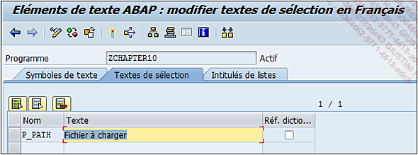
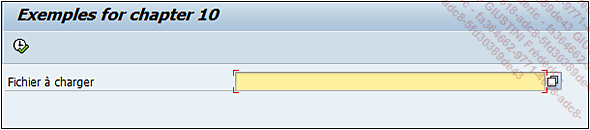

# **AT SELECTION-SCREEN ON RADIOBUTTON GROUP**

- `AT SELECTION-SCREEN ON RADIOBUTTON GROUP group`

  - `Moment d’exécution` : événement créé sur le groupe de boutons `radio group`.

  Exemple avec le groupe `grp` :

  ```JS
  AT SELECTION-SCREEN ON RADIOBUTTON GROUP grp.
  ```

- `AT SELECTION-SCREEN ON VALUE-REQUEST FOR para|selcrit-low|selcrit-high`

  - `Moment d’exécution` : lorsqu’une aide à la recherche est exécutée.

  - `Type de champ` concerné : la valeur doit être unique, il s’agira donc des paramètres (`para`) ou des _champs_ `LOW` ou `HIGH` du `SELECT-OPTIONS` (`selecrit-low`, `selcrit-high`).

  _Utilisation de cet événement pour ouvrir une fenêtre et choisir un répertoire de destination :_

  ```JS
  PARAMETERS : p_path TYPE rlgrap-filename OBLIGATORY.

  AT SELECTION-SCREEN ON VALUE-REQUEST FOR p_path.
  DATA: v_folder   TYPE string.

  CALL METHOD cl_gui_frontend_services=>directory_browse
      CHANGING
          selected_folder = v_folder
      EXCEPTIONS
      OTHERS          = 0.

  p_path = v_folder.
  ```

  

  

  La [METHODE](../../14_Classes/03_Méthodes/README.md) `DIRECTORY_BROWSE` de la classe `CL_GUI_FRONTEND_SERVICE` est utilisée afin de parcourir les répertoires locaux et sélectionner celui qui convient.
