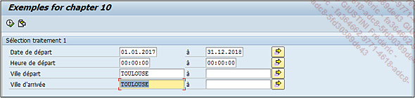

# **VARIANTES**

Il existe un outil permettant à l’utilisateur d’enregistrer les valeurs insérées dans un [ECRAN DE SELECTION](../01_Ecran_de_Sélection/README.md), appelé une variante.

En prenant l’exemple suivant :

```JS
TABLES: ztravel.

SELECTION-SCREEN BEGIN OF BLOCK b00 WITH FRAME TITLE text-t01.
SELECT-OPTIONS: s_trdate FOR ztravel-date_travel
                         DEFAULT sy-datum,
                s_trhour FOR ztravel-hour_travel,
                s_cityfr FOR ztravel-city_from,
                s_cityto FOR ztravel-city_to.
SELECTION-SCREEN END OF BLOCK b00.
```

L’écran apparaîtra ainsi après avoir rempli les _champs_ :


Après un retour arrière, si le programme est à nouveau exécuté, toutes les valeurs ont disparu et tout doit être refait. Pour éviter cela, après avoir renseigné les _champs_, il suffira de cliquer sur le bouton de _sauvegarde_  pour créer une variante.

_L’écran de gestion des variantes ressemble à ceci :_


Il est possible d’y voir plusieurs options :

- La `barre d’outils`, assez rudimentaire cette fois-ci, va seulement proposer de reprendre l’affectation d’écran (si celui-ci est mis à jour dans le programme, le bouton actualisera la liste des objets de l’[ECRAN DE SELECTION](../01_Ecran_de_Sélection/README.md)), et d’accéder à un bouton d’aide.

  

- Viennent ensuite le nom de la _variante_ ainsi qu’une description.

- Des options générales à la _variante_ sont proposées :

  - `Uniquement` pour traitement en arrière-plan : obligera le programme à ne pouvoir être exécuté qu’en arrière-plan et le résultat de l’exécution ne sera visible que dans le log du job associé ([TRANSACTION SM37](../../22_Transactions/TCODE_SM37.md)).

  - `Protéger variante` : permet à la _variante_ de pouvoir être modifiée seulement par la personne qui l’a créée ou la dernière l’ayant modifié. Aussi, si un autre _utilisateur_ décide de l’utiliser et qu’il veut en changer certains _paramètres_, cela lui sera refusé.

  - `Afficher uniquement dans le catalogue` : signifie que la _variante_ sera masquée de la liste des _variantes_ du programme et qu’elle ne pourra être visible que dans le catalogue des _variantes_. À la suite de la partie sur les options de _variantes_, une manipulation sera proposée afin de rencontrer les _variantes_ de catalogue.

  - `Variante système` est un peu particulier, car tout d’abord son nom doit commencer par **SAP** ou **CUS**, et elle doit être transportée dans les systèmes **SAP** ; ainsi elle ne peut être créée pour des programmes locaux (classe de développement `$TMP`), elles sont aussi protégées en écriture (voir option `Protéger variante`). Elles sont utilisées pour des programmes qui appellent d’autres programmes associés à une _variante_ et dont les valeurs de champs ne sont pas souvent modifiées.

- `Affectation écran` donne simplement le numéro de l’[ECRAN DE SELECTION](../01_Ecran_de_Sélection/README.md). En effet, chaque écran est affecté à un numéro et la valeur par défaut de l’[ECRAN DE SELECTION](../01_Ecran_de_Sélection/README.md) est `1 000`.

- Enfin, la liste des champs de l’[ECRAN DE SELECTION](../01_Ecran_de_Sélection/README.md) est affichée regroupant les caractéristiques suivantes :

  

- `Écran de sélection` indique le numéro de l’écran.

- `Nom de zone`.

- `Nom technique de la zone` (cette colonne est affichée si le bouton Nom technique a été utilisé, pour masquer à nouveau la colonne, cliquer alors sur Masquer nom technique).

  

  

- `Type de la zone` (`S` pour `SELECT-OPTIONS`, `P` pour `PARAMETERS`...).

- `Protéger zone` empêche toute modification de valeur.

  

  

- `Masquer zone` comme son nom l’indique masque la zone en question, mais une option de l’écran apparaîtra alors pour la rendre à nouveau visible.

  

  

  

- Afficher zone `JUSQ.` (entendre "JUSQU’A") : supprime l’intervalle pour les zones de type `SELECT-OPTIONS`.

  

  

- `Enregistrer zone sans valeurs` signifie que lors de l’importation de la _variante_, si une zone a déjà été renseignée, elle ne sera pas écrasée par les valeurs de la _variante_. Un exemple concret sera proposé à la suite de la partie sur les options de _variantes_.

- `Désactiver GPA` est utilisée dans le cas où une zone de l’[ECRAN DE SELECTION](../01_Ecran_de_Sélection/README.md) utilise une mémoire système pour importer automatiquement des valeurs (`GET MEMORY ID/SET MEMORY ID`) comme mentionné dans le chapitre [DDIC - ELEMENTS DE DONNEES](../../08_SE11/07_Elements_de_Donnees.md). Cette option permet d’annuler cet import automatique.

- `Zone saisie obligatoire` définit la zone de l’[ECRAN DE SELECTION](../01_Ecran_de_Sélection/README.md) comme requis.

- `Variable sélection`, `Option` et `Nom des variables` sont trois _paramètres_ permettant d’importer les valeurs d’une zone de l’[ECRAN DE SELECTION](../01_Ecran_de_Sélection/README.md) via une [TABLE STANDARD](../../09_Tables_DB/README.md) (comme la [TVARV]()) ou via un calcul dynamique (pour les champs de type `Date` et `Heure`).

  

Pour sauver la _variante_, il suffit de cliquer sur le bouton de sauvegarde. Ainsi, lorsque le programme est exécuté de nouveau, une nouvelle icône apparaît dans la barre d’outils de l’[ECRAN DE SELECTION](../01_Ecran_de_Sélection/README.md) .

En cliquant dessus, la liste des _variantes_ apparaîtra pour sélection sauf celles définies comme étant à afficher uniquement dans le catalogue.


_Manipulation pour rechercher une variante dans le catalogue :_

- Il suffit de se rendre dans l’_éditeur ABAP_ ([TRANSACTION SE38](../../22_Transactions/TCODE_SE38.md)).

- Renseigner le nom du programme et choisir l’option _Variantes_, puis cliquer sur `Afficher`.

  

- Une nouvelle fenêtre apparaît, où il est demandé de renseigner le nom de la _variante_.

  

- Il suffit d’aller dans le menu déroulant suivant pour afficher les _variantes_ du catalogue :

  _Variantes - Catalogue_

  

- La liste des _variantes_ de catalogue s’affiche donc et il est alors possible de les sélectionner pour les modifier.

  

  Force est de constater qu’il est assez difficile de modifier ce type de _variante_. On l’utilisera donc en général lorsqu’il y a peu de modifications, ce qui est peu probable dans le cas d’une _variante_ utilisée pour des tests.

  _Exemple de l’option Enregistrer zone sans valeurs :_

  _Création d’une variante (`SANS_VAL`) avec les zones `Ville de départ` égale à `TOULOUSE` et Ville d’arrivée à `PERPIGNAN`._

  

  L’option `Enregistrer zone sans valeurs` est définie pour la zone `Ville d’arrivée`.

  

  Le programme est exécuté de nouveau ; la zone `Ville de départ` est renseignée avec la valeur `BARCELONE` et Ville d’arrivée avec `TOULOUSE`.

  

  Lorsque la _variante_ `SANS_VAL` est importée, la valeur de la ville de départ est écrasée par celle de la _variante_ (`TOULOUSE`), mais celle de la ville d’arrivée ne l’est pas.

  
