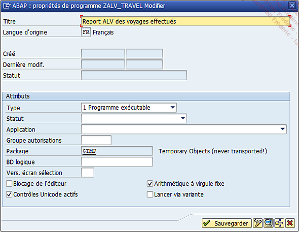

# **DEVELOPPEMENT**

Passons maintenant au _développement_. Celui-ci sera segmenté selon l’[ALGORITHME](../01_Introduction/03_Algorithme.md) défini précédemment. Mais tout d’abord, il faudrait commencer par créer un nouveau programme. Pour cela, la [TRANSACTION `SE38`]() est exécutée pour créer le programme `ZALV_TRAVEL`, comme mentionné dans l’analyse.

Le titre (au choix) sera renseigné, et le type de programme sera défini à `Programme exécutable`.

Le programme sera ensuite sauvegardé et à la demande du package (classe de développement), il sera renseigné comme `objet local`.

Le programme est alors créé.

Il est temps maintenant de passer à la prochaine étape : l’[ECRAN DE SELECTION](./06_Ecran_de_sélection.md).
