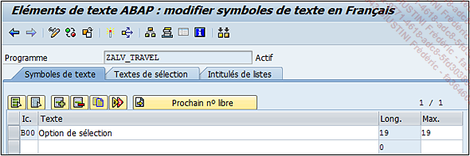
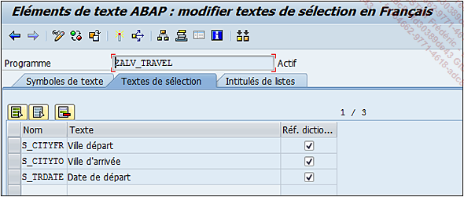
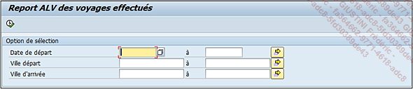

# **ECRAN DE SELECTION**

Pour reprendre la demande, l’_écran de sélection_ possède trois zones :

1. Un intervalle de la date du voyage (`ZTRAVEL-DATE_TRAVEL`) qui sera nommé `S_TRDATE`.

2. Un intervalle de la ville de départ (`ZTRAVEL-CITY_FROM`) `S_CITYFR`.

3. Un intervalle de la ville d’arrivée (`ZTRAVEL-CITY_TO`) `S_CITYTO`.

```JS
*&--------------------------------------------------------------*
*& Rapport  ZALV_TRAVEL
*&
*&--------------------------------------------------------------*
*&
*&
*&--------------------------------------------------------------*
RAPPORT zalv_travel.


TABLES: ztravel.

SELECTION-SCREEN BEGIN OF BLOCK b00 WITH FRAME TITLE text-b00.
SELECT-OPTIONS: s_trdate FOR ztravel-date_travel,
                s_cityfr FOR ztravel-city_from,
                s_cityto FOR ztravel-city_to.
SELECTION-SCREEN END OF BLOCK b00.
```

Les textes peuvent être renseignés ainsi :





En sauvegardant, activant et en le testant, le programme ressemblera à ceci :



Maintenant que l'_écran de sélection_ est créé, les zones de celui-ci peuvent être utilisées pour la sélection et le traitement des données.
