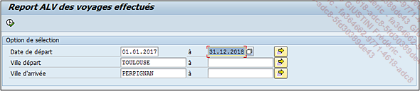
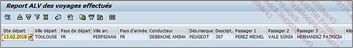

# **TESTS TECHNIQUES**

Une fois activé, le programme est alors terminé et peut être exécuté pour le tester techniquement.

Plusieurs cas peuvent être envisagés et si tout se passe correctement, le programme peut être livré au _fonctionnel_ pour qu’il le teste également. Dans la plupart des cas, la rédaction d’un document technique sera alors nécessaire et à livrer en même temps que le programme.
