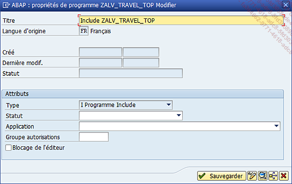
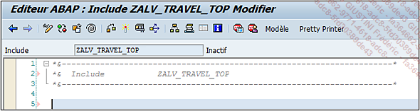
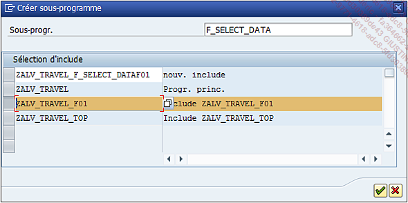
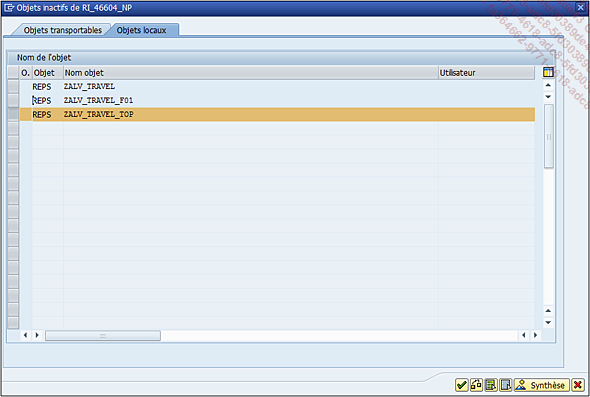
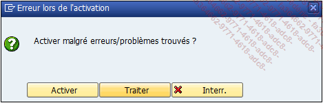
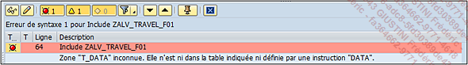
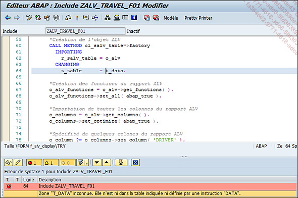

# **ORGANISATION FINALE**

Dans cette section, le programme développé précédemment va être réécrit afin de l’organiser dans des `includes` et des `routines`.

Par exemple, il serait possible de créer deux `includes` :

- Le premier (nommé `ZALV_TRAVEL_TOP`) contiendrait toutes les déclarations de [VARIABLES](../04_Variables/01_Variables.md) ainsi que l’[ECRAN DE SELECTION](../15_Screen/README.md).

- Le deuxième (`ZALV_TRAVEL_F01`) comprendrait toutes les `routines` du programme. Ces `routines` pourraient être au nombre de deux.

  - Une pour la `sélection des données` (nommée `F_SELECT_DATA`).

  - Une autre pour la création et l’affichage du [RAPPORT ALV](../16_ALV/README.md) (`F_ALV_DISPLAY`).

En tout début de programme, les deux includes seront créés grâce à l’instruction `INCLUDE`.

```JS
*&--------------------------------------------------------------*
*& Rapport  ZALV_TRAVEL
*&
*&--------------------------------------------------------------*
*&
*&
*&--------------------------------------------------------------*
RAPPORT zalv_travel.

*Déclaration des variables et écran de sélection
INCLUDE zalv_travel_top.

*Routines
INCLUDE zalv_travel_f01.
```

- À cette étape, les `includes` sont déclarés, mais pas créés. Pour cela, il suffit de double cliquer dessus. À la question de savoir si l’objet doit être créé, il faudra cliquer sur `Oui`, `modifier la description` si besoin, puis `sauvegarder`.

  

  

  

- Une fois l’`include ZALV_TRAVEL_TOP` créé, toutes les déclarations de [VARIABLES](../04_Variables/01_Variables.md) y seront déplacées, ainsi que l’[ECRAN DE SELECTION](../15_Screen/README.md). Au final, il sera composé du code suivant :

  ```JS
  *&--------------------------------------------------------------*
  *&  Include           ZALV_TRAVEL_TOP
  *&--------------------------------------------------------------*

  TABLES: ztravel.


  *VARIABLES D'OBJET
  DATA:
    o_alv           TYPE REF TO cl_salv_table,     "Rapport ALV
    o_alv_functions TYPE REF TO cl_salv_functions,"Fonct. de l'ALV
    o_columns       TYPE REF TO cl_salv_columns_table, "Col. ALV
    o_column        TYPE REF TO cl_salv_column_table.  "Col. Indiv.

  *ECRAN DE SELECTION
  SELECTION-SCREEN BEGIN OF BLOCK b00 WITH FRAME TITLE text-b00.
  SELECT-OPTIONS: s_trdate FOR ztravel-date_travel, "Date de voyage
                  s_cityfr FOR ztravel-city_from, "Ville de départ
                  s_cityto FOR ztravel-city_to.   "Ville d'arrivée
  SELECTION-SCREEN END OF BLOCK b00.
  ```

      Pour une maintenance future (pour soi ou pour d’autres développeurs), il est toujours important de laisser des commentaires dans le code. Pour rappel, deux manières d’en ajouter : soit en faisant commencer la ligne par ’*’, soit par un ’"’ suivi du texte du commentaire.

- Les mêmes étapes sont à exécuter pour l’`include ZALV_TRAVEL_F01`, sauf qu’une fois créé, il sera nécessaire de revenir dans le programme principal.

  ```JS
  *&--------------------------------------------------------------*
  *&  Include           ZALV_TRAVEL_F01
  *&--------------------------------------------------------------*
  ```

- Au final, le début du programme ressemblera à ceci :

  ```JS
  *&--------------------------------------------------------------*
  *& Rapport  ZALV_TRAVEL
  *&
  *&--------------------------------------------------------------*
  *&
  *&
  *&--------------------------------------------------------------*
  RAPPORT zalv_travel.

  *Déclaration des variables et écran de sélection
  INCLUDE zalv_travel_top.

  *Routines
  INCLUDE zalv_travel_f01.

  ...
  ```

      L’ordre de déclaration des includes est très important. En effet, comme `ZALV_TRAVEL_F01` contiendra des routines utilisant des variables déclarées dans `ZALV_TRAVEL_TOP`, si leur déclaration est inversée (d’abord `ZALV_TRAVEL_F01` puis `ZALV_TRAVEL_TOP`), le programme ne pourra pas s’activer, car les variables seront considérées comme inexistantes. Il est intéressant de constater que le contrôle du programme se fait séquentiellement.

- Le code du programme principal se présentera de cette façon :

  ```JS
  *&--------------------------------------------------------------*
  *& Rapport  ZALV_TRAVEL
  *&
  *&--------------------------------------------------------------*
  *&
  *&
  *&--------------------------------------------------------------*
  RAPPORT zalv_travel.

  *Déclaration des variables et écran de sélection
  INCLUDE zalv_travel_top.
  *Routines
  INCLUDE zalv_travel_f01.

  INITIALIZATION.
    "AJOUTER UN TRAITEMENT

  START-OF-SELECTION.
    "AJOUTER UN TRAITEMENT
  ```

- La `routine F_SELECT_DATA` va maintenant être créée. Pour ce faire, il suffit d’ajouter la ligne suivante :

  ```JS
  *Sélection des données
  PERFORM f_select_data.
  ```

  Là encore, l’`instruction PERFORM` ne va pas créer la `routine`, mais va l’appeler. Comme pour les `includes`, il suffira de double cliquer dessus puis à l’invite du message de création, de cliquer sur `Oui`, pour qu’une nouvelle fenêtre apparaisse afin de choisir l’emplacement où la routine doit être créée.

  

  

  Le choix porte sur le `programme principal (ZALV_TRAVEL)`, les deux `includes` (`ZALV_TRAVEL_F01` et `ZALV_TRAVEL_TOP`), mais aussi sur une proposition d’`include` que **SAP** aura créée. Ici, il s’agit de `ZALV_TRAVEL_F_SELECT_DATAF01`, mais il est également possible de modifier ce nom et de créer un autre `include`. **SAP** le déclarera automatiquement dans le programme principal. Pour cet exemple, comme l’`include` est déjà créé, `ZALV_TRAVEL_F01` sera sélectionné puis validé.

  _La routine est alors créée._

  ```JS
  *&--------------------------------------------------------------*
  *&  Include           ZALV_TRAVEL_F01
  *&--------------------------------------------------------------*

  *&--------------------------------------------------------------*
  *&      Form  F_SELECT_DATA
  *&--------------------------------------------------------------*
  *       text
  *---------------------------------------------------------------*
  *  -->  p1        text
  *  <--  p2        text
  *---------------------------------------------------------------*
  FORM f_select_data .

  ENDFORM.
  ```

- Le `SELECT` sera alors déplacé :

  ```JS
  *&--------------------------------------------------------------*
  *&  Include           ZALV_TRAVEL_F01
  *&--------------------------------------------------------------*

  *&--------------------------------------------------------------*
  *&      Form  F_SELECT_DATA
  *&--------------------------------------------------------------*
  *       text
  *---------------------------------------------------------------*
  *  -->  p1        text
  *  <--  p2        text
  *---------------------------------------------------------------*
  FORM f_select_data .

    SELECT t~date_travel,
           t~city_from,
           t~country_from,
           t~city_to,
           t~country_to,
           d~surname && ' ' && d~name   AS driver,
           d~car_brand,
           d~car_model,
           p1~surname && ' ' && p1~name AS passenger1,
           p2~surname && ' ' && p2~name AS passenger2,
           p3~surname && ' ' && p3~name AS passenger3,
           t~kms,
           t~kms_unit,
           t~toll,
           t~gasol,
           t~unit
      FROM ztravel           AS t
      INNER JOIN zdriver_car AS d
        ON t~id_driver       EQ d~id_driver
      INNER JOIN zpassenger  AS p1
        ON t~id_passenger1   EQ p1~id_passenger
      INNER JOIN zpassenger  AS p2
        ON t~id_passenger2   EQ p2~id_passenger
      INNER JOIN zpassenger  AS p3
        ON t~id_passenger3   EQ p3~id_passenger
      INTO TABLE @DATA(t_data)
      WHERE t~date_travel IN @s_trdate
        AND t~city_from   IN @s_cityfr
        AND t~city_to     IN @s_cityto
      ORDER BY t~date_travel.

  ENDFORM.
  ```

- La même chose est à faire avec la `routine F_ALV_DISPLAY`, toujours dans l’`include ZALV_TRAVEL_F01`.

  ```JS
  *&--------------------------------------------------------------*
  *&      Form  F_ALV_DISPLAY
  *&--------------------------------------------------------------*
  *       text
  *---------------------------------------------------------------*
  *  -->  p1        text
  *  <--  p2        text
  *---------------------------------------------------------------*
  FORM f_alv_display .

    TRY.
        "Création de l'objet ALV
        CALL METHOD cl_salv_table=>factory
         IMPORTING
           r_salv_table = o_alv
         CHANGING
           t_table      = t_data.

        "Création des fonctions du rapport ALV
        o_alv_functions = o_alv->get_functions( ).
        o_alv_functions->set_all( abap_true ).

        "Importation de toutes les colonnes du rapport ALV
        o_columns = o_alv->get_columns( ).
        o_columns->set_optimize( abap_true ).

        "Spécifité de quelques colonnes du rapport ALV
        o_column ?= o_columns->get_column( 'DRIVER' ).
        o_column->set_long_text( 'Conducteur' ).
        o_column->set_medium_text( 'Conduct.' ).
       o_column->set_short_text( 'Cond.' ).

        o_column ?= o_columns->get_column( 'PASSENGER1' ).
        o_column->set_long_text( 'Passager 1' ).
        o_column->set_medium_text( 'Pass. 1' ).
       o_column->set_short_text( 'Pass1' ).

        o_column ?= o_columns->get_column( 'PASSENGER2' ).
        o_column->set_long_text( 'Passager 2' ).
        o_column->set_medium_text( 'Pass. 2' ).
        o_column->set_short_text( 'Pass2' ).

        o_column ?= o_columns->get_column( 'PASSENGER3' ).
        o_column->set_long_text( 'Passager 3' ).
       o_column->set_medium_text( 'Pass. 3' ).
        o_column->set_short_text( 'Pass3' ).

        "Affichage du rapport ALV
        o_alv->display( ).

      CATCH cx_salv_msg .
        "Si erreur, affichage du message suivant
       MESSAGE 'Impossible d''afficher le rapport ALV'
               TYPE 'I' DISPLAY LIKE 'E'.
    ENDTRY.

  ENDFORM.
  ```

- Le code du programme principal sera au final celui-ci :

  ```JS
  *&--------------------------------------------------------------*
  *& Rapport  ZALV_TRAVEL
  *&
  *&--------------------------------------------------------------*
  *&
  *&
  *&--------------------------------------------------------------*
  RAPPORT zalv_travel.

  *Déclaration des variables et écran de sélection
  INCLUDE zalv_travel_top.
  *Routines
  INCLUDE zalv_travel_f01.

  INITIALIZATION.
   "AJOUTER UN TRAITEMENT

  START-OF-SELECTION.
    "Sélection des données
    PERFORM f_select_data.

    "Affichage du rapport ALV
    PERFORM f_alv_display.
  ```

- Lorsqu’il devra être activé, la liste des programmes disponibles pour activation apparaîtra.

  

- Sélectionnez ceux qui vous intéressent (à savoir le `programme principal` et ses `deux includes`), puis validez.

  Une erreur va apparaître, cliquez sur `Traiter` pour en avoir le détail.

  

  

  L'erreur indique que la table interne `T_DATA` est inconnue et lorsque l'on double clique sur l'erreur, l'éditeur affiche directement la ligne présentant un problème.

  

  En effet, il existe deux types de variables :

  - les `variables globales` connues dans tout le programme ABAP

  - les `variables locales` connues uniquement dans une routine.

  Pour rappel, la table interne T_DATA a été déclarée directement dans le SELECT.

  Après les changements effectués dans le programme avec la création d’`includes` et de `routines`, la table interne `T_DATA` est maintenant considérée comme créée localement dans la routine `F_SELECT_DATA`, signifiant donc que seule cette routine peut avoir connaissance de l’existence de cette table interne. Pour corriger ce problème, et comme cette table interne est vouée à être utilisée dans d’autres routines, elle doit être déclarée comme globale et pour cela, dans l’`include ZALV_TRAVEL_TOP`.

  Comme elle ne s’appuie sur aucun dictionnaire de données (table de base de données, structure...), un `TYPES` sera alors créé avec les champs utilisés dans le `SELECT`, ainsi que la table interne lui faisant référence.

  ```JS
  *&--------------------------------------------------------------*
  *&  Include           ZALV_TRAVEL_TOP
  *&--------------------------------------------------------------*

  ...

  *TYPES
  TYPES: BEGIN OF gty_data,
           date_travel  TYPE ztravel-date_travel,
           city_from    TYPE ztravel-city_from,
           country_from TYPE ztravel-country_from,
           city_to      TYPE ztravel-city_to,
           country_to   TYPE ztravel-country_to,
           driver       TYPE char40,
           car_brand    TYPE zdriver_car-car_brand,
           car_model    TYPE zdriver_car-car_model,
           passenger1   TYPE char40,
           passenger2   TYPE char40,
           passenger3   TYPE char40,
           kms          TYPE ztravel-kms,
           kms_unit     TYPE ztravel-kms_unit,
           toll         TYPE ztravel-toll,
           gasol        TYPE ztravel-gasol,
           unit         TYPE ztravel-unit,
         END OF gty_data.

  *TABLES INTERNES
  DATA: gt_data TYPE TABLE OF gty_data.  "Tables données de l'ALV

  ...
  ```

      Note de l’auteur : dans un souci de clarté du programme, j’utilise la nomenclature suivante : les variables commençant par la lettre `g` sont déclarées comme globales, alors que celles commençant par la lettre `l` sont déclarées comme locales.

- Ainsi, le `SELECT` peut maintenant être modifié en modifiant le `INTO TABLE` de la routine `F_SELECT_DATA`.

  ```JS
  *&--------------------------------------------------------------*
  *&      Form  F_SELECT_DATA
  *&--------------------------------------------------------------*
  *       text
  *---------------------------------------------------------------*
  *  -->  p1        text
  *  <--  p2        text
  *---------------------------------------------------------------*
  FORM f_select_data .

    "La table interne GT_DATA est vidée de tout contenu
    REFRESH gt_data.

    SELECT t~date_travel,
      ...
      INTO TABLE @gt_data
      ...

  ENDFORM.
  ```

- Aussi, il serait judicieux de commencer le programme en vidant la `table GT_DATA` et pour ce faire, l’instruction [REFRESH](../11_Instructions_itab/13_Refresh/README.md) va être utilisée dans l’`événement INITIALIZATION`.

  ```JS
  *&--------------------------------------------------------------*
  *& Rapport  ZALV_TRAVEL
  *&
  *&--------------------------------------------------------------*
  *&
  *&
  *&--------------------------------------------------------------*
  RAPPORT zalv_travel.

  ...

  INITIALIZATION.
    REFRESH gt_data.

  START-OF-SELECTION.
  ...
  ```

- Il est maintenant nécessaire de modifier la `routine F_ALV_DISPLAY`. De la même manière que la table interne utilisée dans plusieurs routines a dû être déclarée en globale, il est possible d’effectuer la procédure inverse. En effet, toutes les variables d’objet ne sont utilisées que dans la routine de création de l’`ALV`. Pour cet exemple simple, il serait tout à fait possible de les déclarer en local et donc de les supprimer de l’`include ZALV_TRAVEL_TOP`.

  Au final, ce dernier posséderait le code suivant :

  ```JS
  *&--------------------------------------------------------------*
  *&  Include           ZALV_TRAVEL_TOP
  *&--------------------------------------------------------------*

  TABLES: ztravel.

  *TYPES
  TYPES: BEGIN OF gty_data,
           date_travel  TYPE ztravel-date_travel,
           city_from    TYPE ztravel-city_from,
           country_from TYPE ztravel-country_from,
           city_to      TYPE ztravel-city_to,
           country_to   TYPE ztravel-country_to,
           driver       TYPE char40,
           car_brand    TYPE zdriver_car-car_brand,
           car_model    TYPE zdriver_car-car_model,
           passenger1   TYPE char40,
           passenger2   TYPE char40,
           passenger3   TYPE char40,
           kms          TYPE ztravel-kms,
           kms_unit     TYPE ztravel-kms_unit,
           toll         TYPE ztravel-toll,
           gasol        TYPE ztravel-gasol,
           unit         TYPE ztravel-unit,
         END OF gty_data.

  *TABLES INTERNES
  DATA: gt_data TYPE TABLE OF gty_data.  "Tables données de l'ALV

  *ECRAN DE SELECTION
  SELECTION-SCREEN BEGIN OF BLOCK b00 WITH FRAME TITLE text-b00.
  SELECT-OPTIONS: s_trdate FOR ztravel-date_travel, "Date de voyage
                  s_cityfr FOR ztravel-city_from, "Ville de départ
                  s_cityto FOR ztravel-city_to.   "Ville d'arrivée
  SELECTION-SCREEN END OF BLOCK b00.
  ```

- Et la routine F_DISPLAY_ALV aurait le code suivant :

  ```JS
  *&--------------------------------------------------------------*
  *&      Form  F_ALV_DISPLAY
  *&--------------------------------------------------------------*
  *       text
  *---------------------------------------------------------------*
  *  -->  p1        text
  *  <--  p2        text
  *---------------------------------------------------------------*
  FORM f_alv_display .

  *VARIABLES D'OBJET
    DATA:
      lo_alv           TYPE REF TO cl_salv_table, "Rapport ALV
      lo_alv_functions TYPE REF TO cl_salv_functions, "Fonc. ALV
      lo_columns       TYPE REF TO cl_salv_columns_table, "Col. ALV
      lo_column        TYPE REF TO cl_salv_column_table.  "Col. Ind

    TRY.
        "Création de l'objet ALV
        CALL METHOD cl_salv_table=>factory
          IMPORTING
            r_salv_table = lo_alv
          CHANGING
            t_table      = gt_data.

        "Création des fonctions du rapport ALV
        lo_alv_functions = lo_alv->get_functions( ).
        lo_alv_functions->set_all( abap_true ).

        "Importation de toutes les colonnes du rapport ALV
        lo_columns = lo_alv->get_columns( ).
        lo_columns->set_optimize( abap_true ).

        "Spécifité de quelques colonnes du rapport ALV
        lo_column ?= lo_columns->get_column( 'DRIVER' ).
        lo_column->set_long_text( 'Conducteur' ).
        lo_column->set_medium_text( 'Conduct.' ).
        lo_column->set_short_text( 'Cond.' ).

        lo_column ?= lo_columns->get_column( 'PASSENGER1' ).
        lo_column->set_long_text( 'Passager 1' ).
        lo_column->set_medium_text( 'Pass. 1' ).
        lo_column->set_short_text( 'Pass1' ).

        lo_column ?= lo_columns->get_column( 'PASSENGER2' ).
        lo_column->set_long_text( 'Passager 2' ).
        lo_column->set_medium_text( 'Pass. 2' ).
        lo_column->set_short_text( 'Pass2' ).

        lo_column ?= lo_columns->get_column( 'PASSENGER3' ).
        lo_column->set_long_text( 'Passager 3' ).
        lo_column->set_medium_text( 'Pass. 3' ).
        lo_column->set_short_text( 'Pass3' ).

        "Affichage du rapport ALV
        lo_alv->display( ).

      CATCH cx_salv_msg .
        "Si erreur, affichage du message suivant
        MESSAGE 'Impossible d''afficher le rapport ALV'
                TYPE 'I' DISPLAY LIKE 'E'.
    ENDTRY.

  ENDFORM.
  ```

- Une fois activé, le programme est désormais terminé et peut être exécuté pour le tester techniquement.
