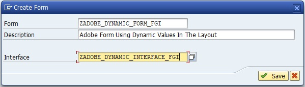
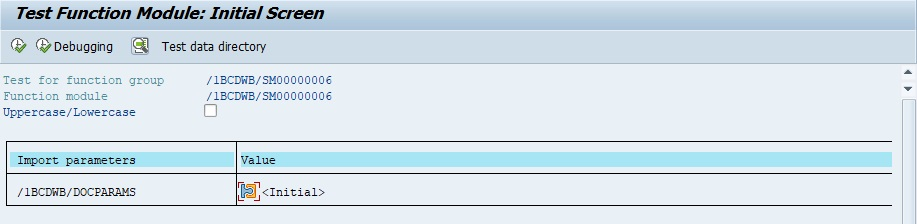

# **TUTORIAL : METHOD TO CREATE AN ADOBE FORM WITH DYNAMIC VARIABLES ALONG WITH EXTERNAL LAYOUT**

## [SFP]() OBJECTS

| Type      | Name                         | Description                                   |
|-----------|------------------------------|-----------------------------------------------|
| Interface | ZADOBE_DYNAMIC_INTERFACE_FGI | Adobe Form Interface for Dynamic Values       |
| Form      | ZADOBE_DYNAMIC_FORM_FGI      | Adobe Form Using Dynamic Values In The Layout |

## PROCESS

1. [TRANSACTION SFP](../22_Transactions/TCODE_SFP.md) : Créer une interface pour le formulaire Adobe

    Interface :
        
    ```
    ZADOBE_DYNAMIC_INTERFACE_FGI
    ```

    Description :

    ```
    Adobe Form Interface for Dynamic Values
    ```

    Interface Type : 

    ```
    ABAP Dictionary-Based Interface
    ```
        

    

    

        Package : 
        
        - Test mode : [ Local Object ]

        - Dev mode : Package spécifié par le client (souvent `Z001` ou `ZTSC`)

    

    Déclarez certaines `Global Datas` à utiliser comme [VARIABLES](../04_Variables/01_Variables.md) dynamiques sous le _formulaire Adobe_. 
    
    Dans ce scénario (basé sur un scnéario réel), ces valeurs seront envoyées au _formulaire Adobe_ depuis un _programme ABAP_ (ou l'application _Webdynpro_).

    Dans tous les cas, ici nous créons 3 paramètres d'import (PERNR, ENAME et BUKRS). Pour cela, ouvrez le node [ Interface de formulaire ] et allez dans [ Importation ]. Ajoutez ou insérez le nombre de lignes nécessaires et inscrivez les paramètres et leur type respectif.

    

2. [TRANSACTION SFP](../22_Transactions/TCODE_SFP.md) : Créer le Layout

    

    

    Form : 
    
    ```
    ZADOBE_DYNAMIC_FORM_FGI
    ```

    Description : 
    
    ```
    Adobe Form using values in the layout
    ```

    

        Package : 
        
        - Test mode : [ Local Object ]

        - Dev mode : Package spécifié par le client (souvent `Z001` ou `ZTSC`)

    Glisser déposer les `Global Variables` de l'interface dans le [ Context ] du `Layout`.

    

    

    Si vous souhaitez importer un modèle pdf (import de Design), changer le Type du Layout par `ZZCI Layout` (ou `ZCI Layout`).

    

3. Création du Layout (si aucun import de Design)

    Cliquez sur l'onglet [ layout ] (Mef en français - Mise en forme)

    

    Puis sur le bouton [ Layout ] (Mise en forme en français)

    

    Cliquez sur l'onglet [ Vue des données ] du formulaire. Faites glisser les paramètres (PERNR, ENAME et BUKRS) et déposez-le sur le formulaire. ce faisant, le binding aura lieu automatiquement.

    

    

    Modifiez leur place respective puis vous pouvez sauvegarder et quitter la fenêtre.
    Sauvegardez et activez le Fom.

    Passez à l'étape 6. ABAP Driver program pour Call Adobe Form si vous n'importez pas de Design particulier.

4. Import du design du Layout (si un design existe déjà)

    Importez maintenant le design à partir d’un fichier externe. Vous devez d’abord convertir le fichier de conception tel qu’un fichier .doc en un fichier .pdf, ceci est important car le formulaire Adobe n’acceptera aucun autre format de conception. Il existe de nombreux logiciels gratuits tiers disponibles pour convertir des fichiers en PDF, même des convertisseurs PDF gratuits en ligne sont disponibles.

    Pour importer le fichier pdf, allez dans `Outils` -> `Importer` -> `Choisir le fichier`

    [Design_exemple.pdf](../ressources/Design_exemple.pdf)

    

    

    

    

    Vous pouvez maintenant voir la `mise en page de conception` importée dans la vue `Conception`. Tous les champs sont modifiables. Nous pouvons désormais placer nos `variables dynamiques` dans la mise en page là où cela est nécessaire.

    Créer une zone de texte.

    

    Importez maintenant les `variables dynamiques` dans la mise en page.

    Sélectionnez la zone de texte dans laquelle vous souhaitez ajouter la variable ou créez une nouvelle fenêtre de texte et placez-la là où vous souhaitez la variable dynamique.

    Si vous souhaitez ajouter la `variable dynamique` à une position à l'intérieur d'une phrase placez le curseur sur la position de la phrase et faites un clic droit.

    

    Cliquer sur [ Floating field ].

    

    Vous pouvez maintenant voir qu'un champ de texte dans un symbole "{ }" est apparu, il s'agit de la variable dynamique qui capturera les valeurs entrantes du programme pilote/Webdynpro.

    Accédez maintenant à l'onglet [ Binding ] sur le côté droit de la vue de conception dans la palette d'objets. Cliquez ensuite sur l'icône à droite du champ [ Data Binding ].

    

    Étant donné que le `champ flottant` actuel n'a aucune relation avec la `variable globale` dans laquelle les valeurs sont transmises, nous devons mettre à jour les propriétés de `Binding` du champ flottant actuel. Sélectionnez donc l'icône de `Binding par défaut` et sélectionnez la `variable globale` que vous souhaitez placer dans la liste (`LV_Sl_NO`).

    

    Sélectionnez `Update all related properties` et cliquez sur [ OK ]. Cela remplacera les propriétés de liaison par défaut des `variables flottantes` par les propriétés de notre `variable globale` et désormais, le champ flottant agira comme un conteneur pour afficher les valeurs que nous transmettons à la `variable globale`.

    

    Désormais, le nom de la variable flottante sera également remplacé par le nom de la `variable globale`. Cela nous aidera à identifier les différents champs flottants en conséquence.

    

    Faites de même pour tous les champs obligatoires où les valeurs dynamiques sont requises.

    [ ... ]

    Maintenant, enregistrez et activez le formulaire Adobe.

5. Output (si test en sfp)

    Executer le Form Adobe.

    

    [ Output Device ] : [ LP01 ]

    Then [ Print Preview ]

    

6. ABAP Driver program pour Call Adobe Form

    `ZTEST_ADOBE_FGI`

    ```js
    *&---------------------------------------------------------------------*
    *& Report ZTEST_ADOBE_FGI
    *&---------------------------------------------------------------------*
    *&
    *&---------------------------------------------------------------------*
    REPORT ztest_adobe_fgi.

    INCLUDE ztest_adobe_fgi_top.
    INCLUDE ztest_adobe_fgi_scr.
    INCLUDE ztest_adobe_fgi_f01.

    INITIALIZATION.

    START-OF-SELECTION.

    PERFORM call_form.

    END-OF-SELECTION.
    ```

    `ZTEST_ADOBE_FGI_TOP`

    ```js
    *&---------------------------------------------------------------------*
    *& Include          ZTEST_ADOBE_FGI_TOP
    *&---------------------------------------------------------------------*

    TYPES: ty_outputparams TYPE sfpoutputparams,  " Form Processing Output Parameter
        ty_docparams    TYPE sfpdocparams.     " Form Parameters for Form Processing

    DATA: gs_outputparams TYPE sfpoutputparams,   " Form Processing Output Parameter
        gs_docparams    TYPE sfpdocparams.      " Form Parameters for Form Processing

    DATA: gv_fm_name TYPE rs38l_fnam,             " Name of Function Module previously created
        gv_pernr   TYPE pa0001-pernr,           " Personnel Number
        gv_ename   TYPE pa0001-ename,           " Formatted Name of Employee or Applicant
        gv_bukrs   TYPE pa0001-bukrs.           " Company Code
    ```

    `ZTEST_ADOBE_FGI_SCR`

    ```js
    *&---------------------------------------------------------------------*
    *& Include          ZTEST_ADOBE_FGI_SCR
    *&---------------------------------------------------------------------*

    PARAMETERS: p_pernr TYPE pa0001-pernr.  " Personnel Number
    ```

    `ZTEST_ADOBE_FGI_F01`

    ```js
    *&---------------------------------------------------------------------*
    *& Include          ZTEST_ADOBE_FGI_F01
    *&---------------------------------------------------------------------*
    *&---------------------------------------------------------------------*
    *& Form CALL_FORM
    *&---------------------------------------------------------------------*
    *& text
    *&---------------------------------------------------------------------*
    *& -->  p1        text
    *& <--  p2        text
    *&---------------------------------------------------------------------*
    FORM call_form .

    " ----------- Définir les paramètres de sortie et ouvre le Spool Job *

    gs_outputparams-device   = 'PRINTER'. " Output Device
    gs_outputparams-dest     = 'LP01'.    " Spool: Output device
    gs_outputparams-nodialog = 'X'.       " Suppress User Dialog
    gs_outputparams-preview  = 'X'.       " Preview

    " ------------------------- Appel de la fonction d'ouvertur d'un job *

    CALL FUNCTION 'FP_JOB_OPEN'
        CHANGING
        ie_outputparams = gs_outputparams " Output Device
        EXCEPTIONS
        cancel          = 1
        usage_error     = 2
        system_error    = 3
        internal_error  = 4
        OTHERS          = 5.
    IF sy-subrc <> 0.
    * Implement suitable error handling here
    ENDIF.

    " ------------ Récupération du Module Fonction associé au formulaire *

    CALL FUNCTION 'FP_FUNCTION_MODULE_NAME'
        EXPORTING
        i_name     = 'ZADOBE_DYNAMIC_FORM_FGI'    " (SFP) Form name
        IMPORTING
        e_funcname = gv_fm_name.          " Name of Function Module previously created
    IF sy-subrc <> 0.
    * Implement suitable error handling here
    ENDIF.

    " --------------------------------- Définir les paramètres de langue *

    gs_docparams-langu   = 'EN'.          " Language Key
    gs_docparams-country = 'EN'.          " Country/Region Key

    " -------------------------------------------- Sélection des données *

    SELECT SINGLE pernr ename bukrs
        FROM pa0001
        INTO (gv_pernr, gv_ename, gv_bukrs)
        WHERE pernr EQ p_pernr.

    " ----------------------------------------- Appel du Fonction Module *

    CALL FUNCTION gv_fm_name
        EXPORTING
        pernr          = gv_pernr         " Personnel Number
        ename          = gv_ename         " Formatted Name of Employee or Applicant
        bukrs          = gv_bukrs         " Company Code
        EXCEPTIONS
        usage_error    = 1
        system_error   = 2
        internal_error = 3.
    IF sy-subrc <> 0.
    * Implement suitable error handling here
    ENDIF.

    " ------------------------------------------------- Dermeture du job *

    CALL FUNCTION 'FP_JOB_CLOSE'
        EXCEPTIONS
        usage_error    = 1
        system_error   = 2
        internal_error = 3
        OTHERS         = 4.
    IF sy-subrc <> 0.
    * Implement suitable error handling here
    ENDIF.

    ENDFORM.
    ```

7. Execution du programme

    Executez le programme :

    ```abap
    ZTEST_ADOBE_FGI
    ```

    

    

    