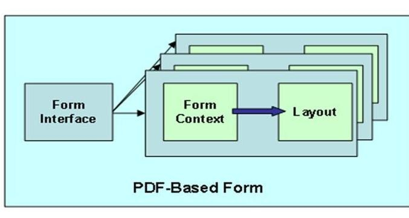
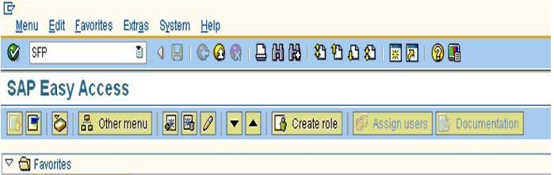

# **CONCEPTS**

    L'utilisation du format PDF assure que l'apparence du formulaire reste le même, qu'importe l'environnement dans lequel il est utilisé. Il aide à optimiser le business process en automatisant la création de données pour les systèmes SAP, ce qui fait gagner du temps et des coûts (dans le cas de formulaire interactifs). Cela permet également de passer les limitations des formulaires habituels (entrée de données manuelle, erreurs récurrentes et facilement obsolètes, traçabilité, coûts élevés en production et stockage).

Cas d'utilisation des `FORM PDF` :

- Confirmation de commande

- Factures

- Déclarations de compte

- Vérifications

- Déclarations des salaires

- Bons de livraison

- Formulaire custom

- Formulaire spécifique (industrie)

## Création PDF

Utilisation de la [TRANSACTION `SFP`]() pour accéder à Form Builder ou via la [TRANSACTION `SE80`]() (pour créer une interface puis le formulaire).

Avant de créer un `PDF`, vous devez disposer d'une interface contenant tous les champs que vous utiliserez dans le formulaire.

Par conséquent, avant de créer un formulaire, vous devez créer une interface et attribuer cette interface dans la fenêtre contextuelle, qui apparaît lors de la création du formulaire respectif.

    SFP signifie SAP Forms Process.

_Structure d'un formulaire PDF_

Les étapes impliquées dans le développement de PDF sont :

1. **INTERFACE - DEFINITION DES PARAMETRES**

    Interface de formulaire qui envoie les données de l'application au formulaire.

    L'interface peut être atteinte via une [TRANSACTION `SE80`]() ou la [TRANSACTION `SFP`](). L'interface des [SMARTFORMS](../19_Smarform/README.md) et `PDF` ne sont pas compatible.

    Si vous cliquez sur la case à cocher - `Smart Form compatible interface` dans l'onglet `Propriétés`, le programme d'impression pour [SMARTFORMS](../19_Smarform/README.md) peut également être utilisé pour les `PDF`.
  
    Dans l'interface `PDF`, vous utilisez uniquement les instructions `TYPE`. Ne cochez jamais la case `passer par valeur` car cela affectera les performances, sauf si cela est nécessaire.

    S'il s'agit d'une [TABLE](../09_Tables_DB/README.md), la [TABLE](../09_Tables_DB/README.md) entière sera transmise. Des exceptions peuvent être créées et déclenchées au niveau de l'interface.

    Le `PDF` ne peut pas récupérer les informations monétaires à partir du [DICTIONNAIRE DE DONNEES](../08_SE11/README.md). Ces détails doivent être fournis dans les champs de devise au stade de l'interface lui-même.

2. **CONTEXTE - MAPPAGE DES PARAMETRES DE L'INTERFACE**

    Contexte du formulaire qui contient la logique du formulaire. 
    
    Cette logique contrôle la mise en forme dynamique du formulaire. Dans le contexte (également appelé `form context`), vous spécifiez quelles données sont copiées de l'interface vers le formulaire.

3. **MISE EN PAGE - CONCEPTION DES FORMULAIRES**

    Mise en page dans laquelle vous définissez le positionnement des données de sortie, leur apparence dans les graphiques et la conception des pages.
 
    Les interfaces de formulaire et les contextes de formulaire avec mise en page sont appelés objets de formulaire (`form objects`). Il s’agit de différents types d’objets transportables. La même interface peut être utilisée par plusieurs formulaires (comme par exemple dans un bon de commande, des formulaires de planification, etc.).

    