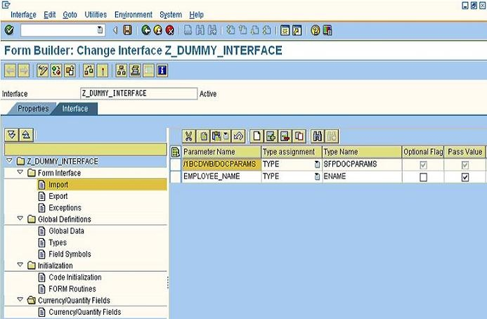

# **FORM OBJECT CREATION**

1. **CREATION D'UN OBJET DE FORMULAIRE**

    - Création d'un objet de formulaire dans le navigateur du référentiel

        Vous vous trouvez dans le navigateur de référentiel d'ABAP Workbench.
        Sélectionnez un `Package`.

        Pour créer une interface de formulaire, procédez comme suit :

        1. Dans le menu contextuel du package, choisissez

            `Créer` -> `Objet de formulaire` -> `Interface`.
    
        2. Entrez le `nom de l'interface` dans la boîte de dialogue de la création d'interface.

    - Pour créer un formulaire avec un contexte et une mise en page, procédez comme suit :
        
        1. Dans le menu contextuel du package, choisissez
        
            `Créer` -> `Objet de formulaire` -> `Formulaire`.
    
        2. Entrez le `nom du formulaire` dans la boîte de dialogue de création de formulaire.

        3. Entrez le `nom de l'interface` que vous souhaitez que le formulaire utilise.
    
        4. Choisissez `Enregistrer`.
    
        5. La boîte de dialogue de création d'une entrée de répertoire d'objets apparaît.
    
        6. Saisissez vos données et enregistrez l'objet.

2. **CONCEPT DE PAGE ET ELEMENTS DE FORMULAIRE**

    Définition
 
    Vous spécifiez la mise en page d'un formulaire et déterminez l'ordre des pages qui ont des structures différentes. Textes, données, tableaux et divers autres types d'objets peuvent être affiché dans la plage de sortie d’une page de formulaire.

    Les différents types de pages suivants peuvent être utilisés pour structurer un formulaire :

    1. Pages maîtres

    2. Pages du corps

        Vous pouvez positionner différents éléments sur ces pages :

        1. Objets standards

            a. Objets statiques tels que textes, graphiques, carrés et rectangles, cercles, lignes.

            b. Objets dynamiques tels que boutons, cases à cocher, champs date/heure, liste déroulante, etc.

        2. Objets définis par l'utilisateur
  
        3. Codes-barres.

    

3. **CREATION DE L'INTERFACE**

    Cliquez dans la case à cocher correspondante, saisissez le nom et créez l'interface. Saisissez la description et enregistrez-la en tant qu'objet local. Au final, vous obtenez l'écran ci-dessous.

    

4. **INTERFACE DE FORMULAIRE**

    Lorsque vous cliquez sur le champ `Importer`, vous obtenez l'écran ci-dessus. Ici, vous pouvez ajouter les champs dont nous avons besoin dans le formulaire. Ici, j'ai ajouté le champ `EMPLOYEE_NAME` et activé l'interface.

    

    Notez que le paramètre `1BCDWB/DOCPARAMS` est commun à toutes les interfaces. Il vient par défaut et a un `TYPE` `SFPDOCPARAMS`. Ce paramètre est utilisé
    pour transmettre la clé du pays, la langue et d'autres détails associés lors de l'appel du formulaire via le module de fonction standard.
 
    Lorsque vous double-cliquez sur `Exporter`, vous voyez le paramètre standard `/1BCDWB/FORMOUTPUT` du module fonction généré. Vous ne pouvez pas modifier ce paramètre. Vous utilisez ce paramètre dans votre programme d'application pour rendre le formulaire généré disponible au format `PDF` pour un traitement ultérieur.

    Comme nous avons activé l'interface, nous pouvons maintenant créer un formulaire et attribuer cette interface au formulaire. Pour cela, revenez en arrière et créez le formulaire.