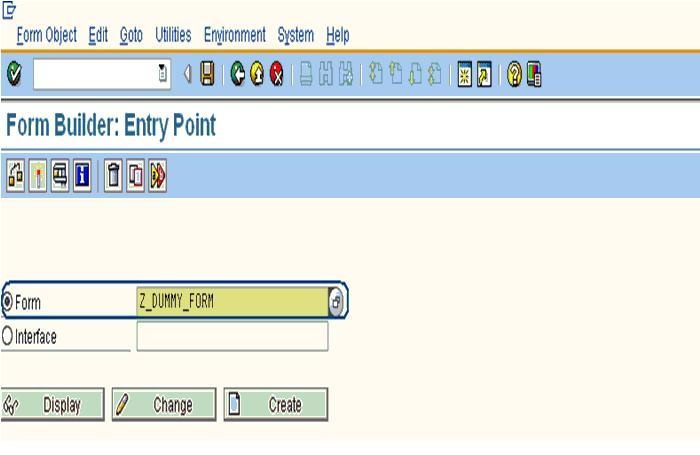
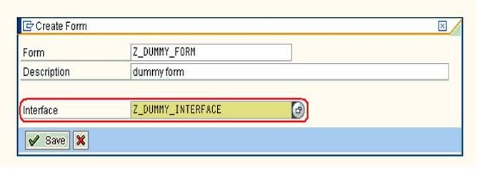
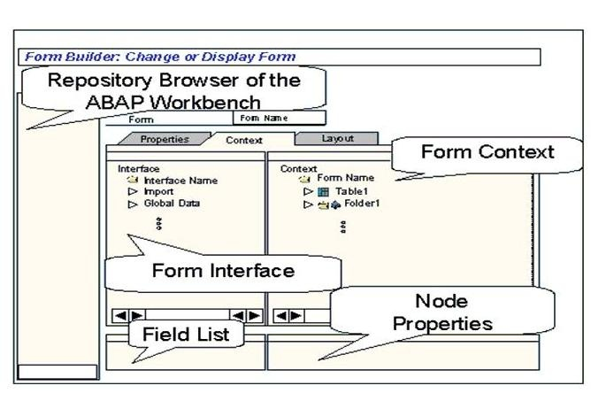
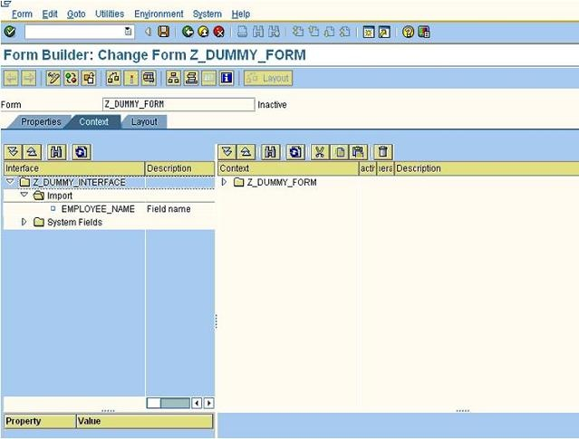
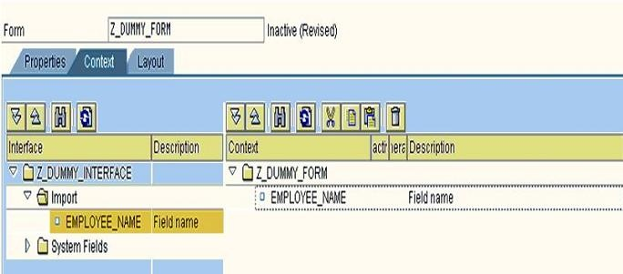

## **FORM CREATION**

1. **CREATION DU FORMULAIRE**

    

2. **ASSIGNEMENT DE L'INTERFACE**

    Dans la boîte de dialogue qui apparaît, attribuez l'`interface` que vous devez utiliser (celle que vous avez déjà créée et activée) comme sur la figure ci-dessous.

    

3. **VUE SCHEMATISEE DU FORM BUILDER**

    

    Le graphique ci-dessus montre la structure de l'écran qui apparaît lorsque vous sélectionnez l'onglet `Contexte` dans le `Form Builder`. L'interface sur laquelle le formulaire est basé est affiché, mais ne peut pas être modifié ici.

    

    Une fois que vous avez créé le formulaire (enregistrez-le en tant qu'`objet local`), vous obtenez l'écran ci-dessus, qui aura l'interface attribuée à gauche et le contexte à droite.

4. **INCLUDING THE FIELDS**

    Maintenant, pour que le formulaire accède au champ, nous devons inclure le champ requis dans le `contexte du formulaire`. Cela se fait en faisant glisser les champs requis et en le plaçant au niveau du contexte. (Ici à des fins de démonstration, je n'ai créé qu'un seul paramètre et il a été inclus dans le contexte en le faisant glisser depuis le niveau de l'interface).

    

5. **PROPRIETES DANS LE CONTEXTE**

  - **Utilisation**

    Les propriétés décrivent le contenu ou la signification d'un nœud.

  - **Activités**

    1. Double-cliquez sur le `nœud` pour ouvrir l'`écran des propriétés`.

    2. Vous pouvez maintenant modifier les `propriétés générales` telles que le nom ou la description du `nœud`, ou définir le nœud comme `Actif` ou `Inactif`.

    3. Seuls les `nœuds actifs` sont envoyés à la mise en page du `Form Builder` et utilisés dans la sortie du formulaire.

    4. En fonction du `nœud` choisi, le système affiche également des propriétés supplémentaires spécifiques au `nœud`, ainsi que les propriétés générales. Pour un explication, voir la description du `nœud`.

    5. En plus des propriétés, pour certains `nœuds`, vous pouvez également spécifier des conditions pour la sortie du formulaire.

6. **CONDITIONS**

  - **Utilisation**

    1. Vous pouvez définir des conditions pour des `nœuds individuels` ou pour des `sous-hiérarchies` entières du contexte.

    2. Un `nœud`, ou tous ses `sous-nœuds`, n'est alors traité que si la condition associée est remplie.
 
    3. Pour sélectionner parmi deux `sous-hiérarchies` alternatives dans la sortie du formulaire, utilisez le `nœud alternatif`.
 
  - **Conditions préalables**

    Il existe un `nœud` pour lequel vous souhaitez définir des conditions. Ce `nœud` doit permettre de définir des conditions.

  - **Caractéristiques**

    Vous pouvez définir des conditions à l'aide de relations logiques.