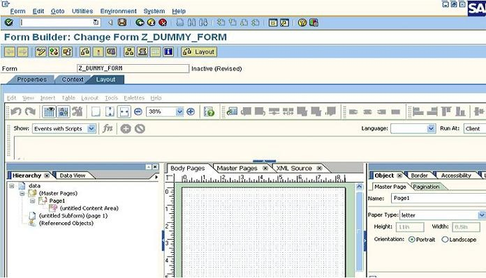
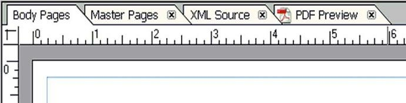

# **LAYOUT**

1. **LAYOUT**

    

    Une fois les paramètres requis inclus dans le contexte, vous pouvez désormais accéder à la mise en page pour concevoir le formulaire. Cliquez dans l'onglet `Mise en page` et vous obtenez l'écran ci-dessous, qui est essentiellement le concepteur `Adobe`.

    

    1. Vous créez le `Body` et les pages `Master` pour la conception du formulaire dans l'éditeur de mise en page.

    2. Vous pouvez également afficher et modifier la conception du formulaire et prévisualiser le formulaire (le formulaire avec lequel l'utilisateur travaillera) au format PDF.

    3. L'éditeur de mise en page contient quatre onglets : 
    
      - pages de corps
      
      - pages maîtres
      
      - source XML
      
      - aperçu PDF.

2. **TYPES DE LAYPOUT DE FORMULAIRE**

    `Live Cycle Designer` propose deux types de techniques de mise en page de formulaire avec lesquelles vous pouvez travailler :

    - Disposition `statique` :

      Ces formulaires ont des mises en page fixes. Lorsqu'il est présenté à l'utilisateur final, le formulaire conserve sa mise en page d'origine, quelle que soit la quantité de données disponibles pour remplir le formulaire.

    - Disposition `dynamique` :

      Un formulaire avec une mise en page dynamique est conçu pour s'agrandir ou se réduire en fonction de la quantité de données disponibles pour le remplir.

3. **CONTENANT DU DESIGN**

    Les composants clés suivants constituent une conception de formulaire :

    1. **Pages Master**

        Chaque conception de formulaire contient au moins une page `Master` créée automatiquement par `Live Cycle Designer`.

        Les pages `Master` définissent l'orientation et les dimensions des pages de corps.
 
        Les pages `Master` sont responsables du formatage des pages de corps.
 
        Fournissez un format d’arrière-plan et de mise en page pour plusieurs pages de corps dans une conception de formulaire.
 
        Chaque page `Master` est créée avec une zone de contenu par défaut qui couvre toute la page.

    2. **Pages Body**

        Les pages `Body` représentent les pages d'un formulaire.

        Chaque page `Body` tire sa taille et son orientation d'une page `Master`.
        
        Chaque page `Body` est associée à la page `Master` par défaut créée par LiveCycle Designer.
        
        Vous pouvez choisir quelle page `Master` attribuer à une page `Body`.

    3. **Zones de contenu**

        Les zones de contenu définissent l'endroit où les objets peuvent être placés ou déposés sur les pages `Body`.

        Lorsque vous concevez un formulaire, vous ne pouvez pas placer un objet sur une page `Body` à moins qu'il ne se trouve à l'intérieur de la zone délimitée par une zone de contenu.
 
        Vous pouvez ajouter des zones de contenu uniquement aux pages `Master`.

    4. **Sub Forms**

        Les `Sub Forms` sont des objets conteneurs que vous pouvez utiliser pour regrouper des objets de conception de formulaire, notamment : des champs, des adresses, des images, etc.

        Un `Sub Form` permet la gestion de l'ancrage, de la mise en page et de la géométrie des objets.

        Vous pouvez également configurer les objets de `Sub Forms` pour qu'ils soient reproductibles.

    5. **Field objects**

        Dans la mise en page, il existe un certain nombre d'`objets de champ` capables de capturer, de fusionner et d'afficher des données telles que :

        - Bouton

        - Cocher la case

        - Champ date/heure

        - Liste déroulante

        - Champ d'image

        - Champ de texte

        - Zone de liste

        - Champ numérique

    6. **Boilerplate objects**

        Les `Boilerplate objects` sont des objets en lecture seule qui améliorent l'attrait esthétique d'un formulaire et peuvent fournir un contexte ou une assistance aux utilisateurs. Ils peuvent être ajoutés à pages `Bodyu` ou pages `Master`.

        Les objets suivants sont des `Boilerplate objects` :

        - Cercle

        - Image

        - Ligne

        - Rectangle

        - Texte