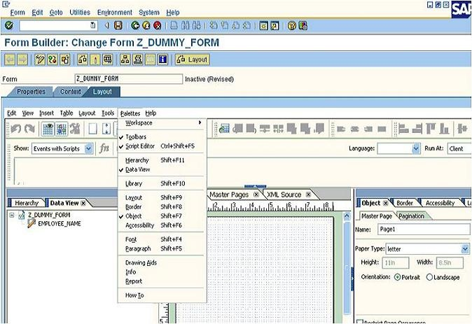
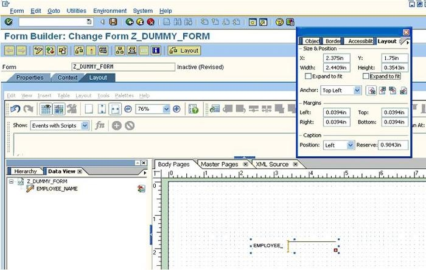
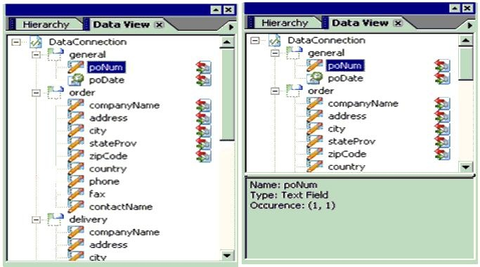
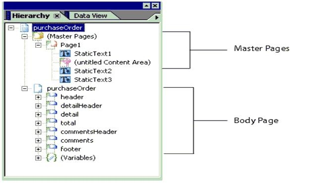
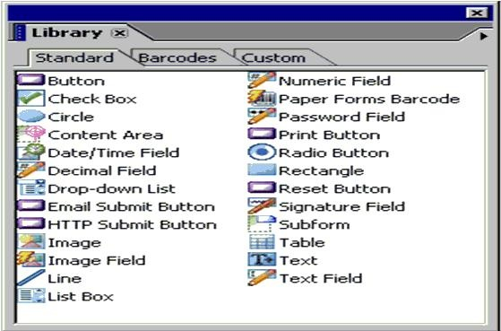
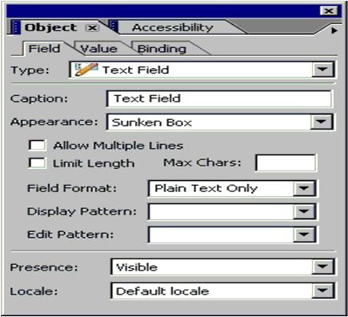
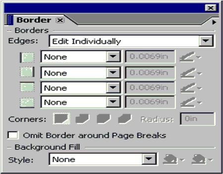
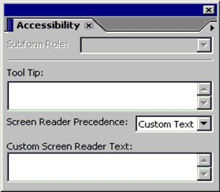
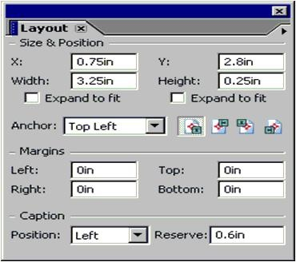

# **PALETTE**

  

   Si vous ne voyez aucune `palette` aux deux extrémités, recherchez-les dans le champ `Palettes`.

  Les `palettes` offrent un accès facile aux outils sans encombrer votre espace de travail. Les `palettes` peuvent inclure un ou plusieurs onglets, chacun contenant des propriétés communes.
 
  Par exemple, tous les objets sont stockés dans la `palette Bibliothèque`. Comme vous pouvez le voir dans la figure suivante, les objets sont regroupés en onglets.

  Vous pouvez organiser les `palettes` dans l'espace de travail en fonction de votre style de travail. Par exemple, vous pouvez masquer les `palettes` rarement utilisées et déplacer celles fréquemment utilisées dans une seule fenêtre de `palette`.

- **DATA VIEW PALETTE**

  

  La `Data view palette` contient les paramètres et les structures que nous avons définis au niveau du `contexte` (Ici le paramètre - 'EMPLOYEE_NAME'). 
    
  La `palette hiérarchique` contient le `flux` avec lequel nous avons défini les champs dans la mise en page. Tous les objets / les champs que vous utilisez dans la conception de mise en page sont reflétés dans la `hiérarchie`. Par défaut, la `hiérarchie` contient une page `Master` et la page `Body`. Vous placez les champs de la présentation en les faisant glisser depuis la `Data view palette`.

  Les propriétés de tous les objets de la mise en page sont conservées dans les palettes - `Mise en page`, `Bordure`, `objet` et `Accessibilité`.

  La conception du formulaire peut être réalisée, à votre niveau de confort, en définissant les échelles et les mesures dans la palette `Aides au dessin`.

  

- **HIERARCHY PALETTE**

  

  La `Hierarchy Palette` est une représentation graphique du contenu des onglets Pages `Body` et Pages `Master`. La palette affiche également les objets référencés sous le `nœud Objets référencés`. Un `objet référencé` est un objet qui est ajouté à un formulaire uniquement lorsque cela est requis.

- **LIBRARY PALETTE**

  

  La `Library Palette` contient tous les objets que vous pouvez ajouter à une conception de formulaire. Les objets sont organisés en groupes. Chaque groupe est contenu dans un onglet portant le nom du groupe.

- **OBJECT PALETTE**

  

  Utilisez la `palette Objet` pour modifier les propriétés spécifiques à l'objet sélectionné. L'objet sélectionné dans l'éditeur de mise en page détermine quels onglets sont disponibles dans cette `palette`.

- **BORDER PALETTE**

  

  Utilisez la `Border Palette` pour modifier les propriétés de bordure des objets dans la conception de formulaire. Vous pouvez modifier les bordures individuellement (gauche, droite, haut et bas) ou ensemble. 
    
  Vous pouvez également spécifier le type de coin de bordure et la couleur d'arrière-plan.

- **ACCESSIBILITY PALETTE**

  

  Utilisez l'`Accessibility Palette` pour spécifier le texte personnalisé d'un objet qu'un lecteur d'écran compatible` Microsoft Active Accessibility` (`MSAA`) lit lors de son passage dans le formulaire. Si un texte de lecteur d'écran personnalisé est disponible pour l'objet, le lecteur d'écran lira le texte personnalisé et non l'info-bulle.

- **LAYOUT PALETTE**

  

  Lorsque vous sélectionnez un objet sur un `Body` ou une page `Master`, la `Layout Palette` affiche automatiquement les paramètres de l'objet sélectionné. Tout changement que vous apportez aux paramètres de la `Layout Palette` sont appliqués à l'objet sélectionné.

  De même, vous pouvez modifier la plupart des paramètres de présentation d'un objet directement dans l'éditeur de présentation. Par exemple, pour modifier la position d'un objet, vous pouvez le faire glisser vers le nouvel emplacement sur la page.