# ENHANCEMENT IMPLEMENTATION

[TRANSACTION CMOD](../22_Transactions/TCODE_CMOD.md)

1. Create Project (Exemple)

    - Project: `ZPM11209` 
    - Short text: `Automatic assignment of E-OTPs for OT PMs`
    - Package: `ZPM`

    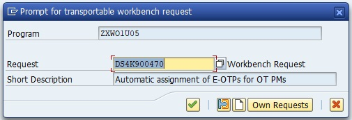
    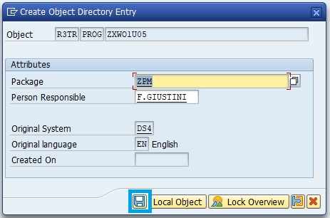
    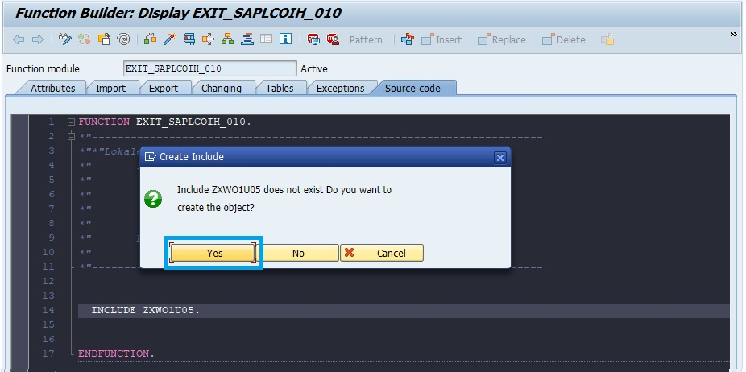

2. Create OT request

    - Short Description: Automatic assignment of E-OTPs for OT PMs
    - Project: Synergie (DS4_P00001) Projet Synergie
    - Target: QSA

    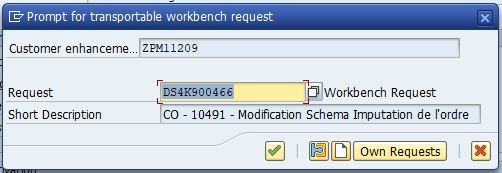
    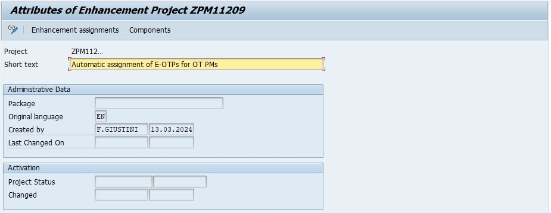
    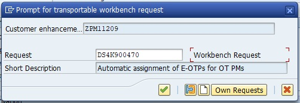

3. Define User-exit

    TABLE MODSAP to find Exit Name

    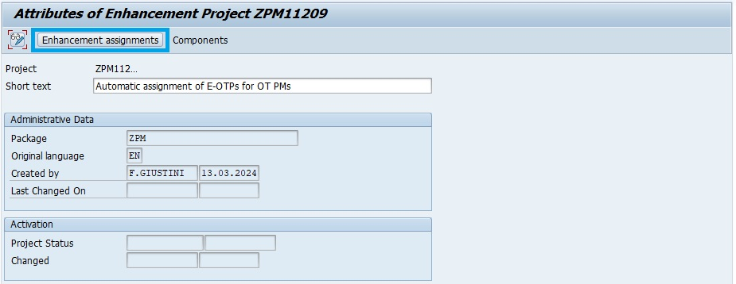
    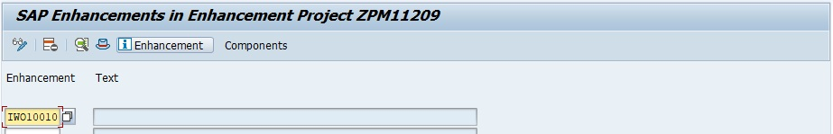
    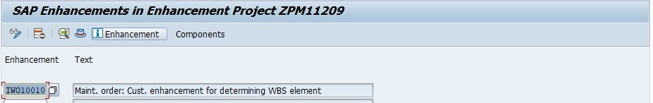

4. Go to Components

    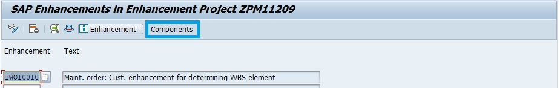
    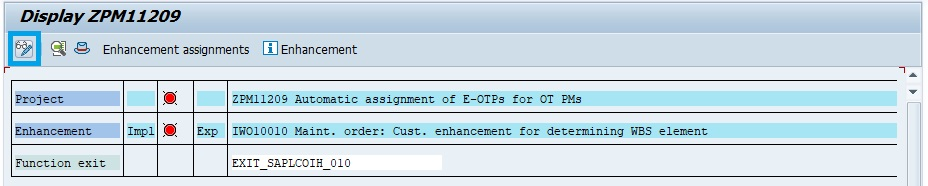
    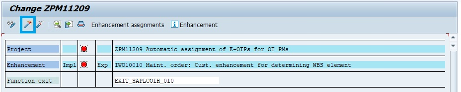
    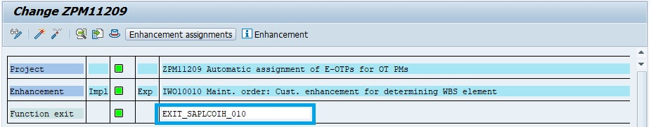

5. INCLUDE Implementation (Double-clic then Enter)

    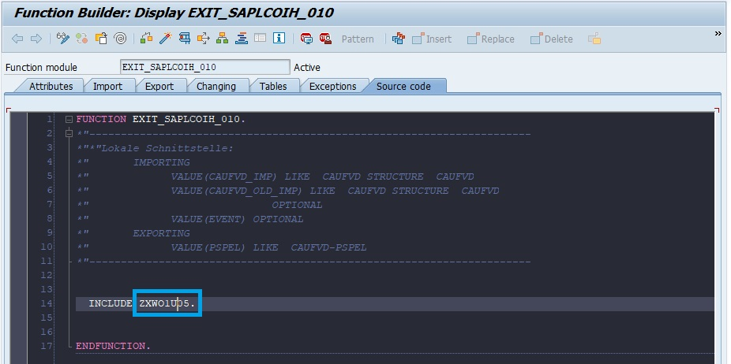
    
    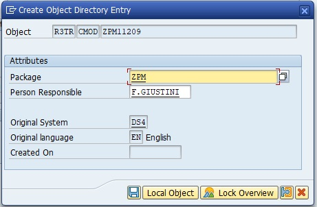
    