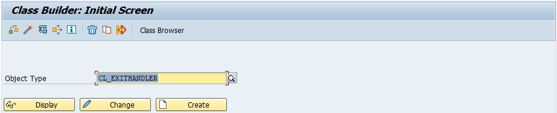
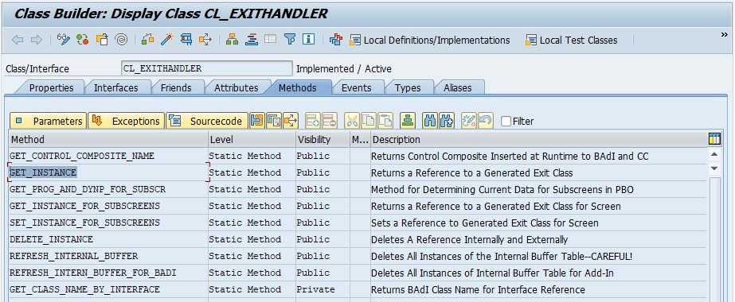
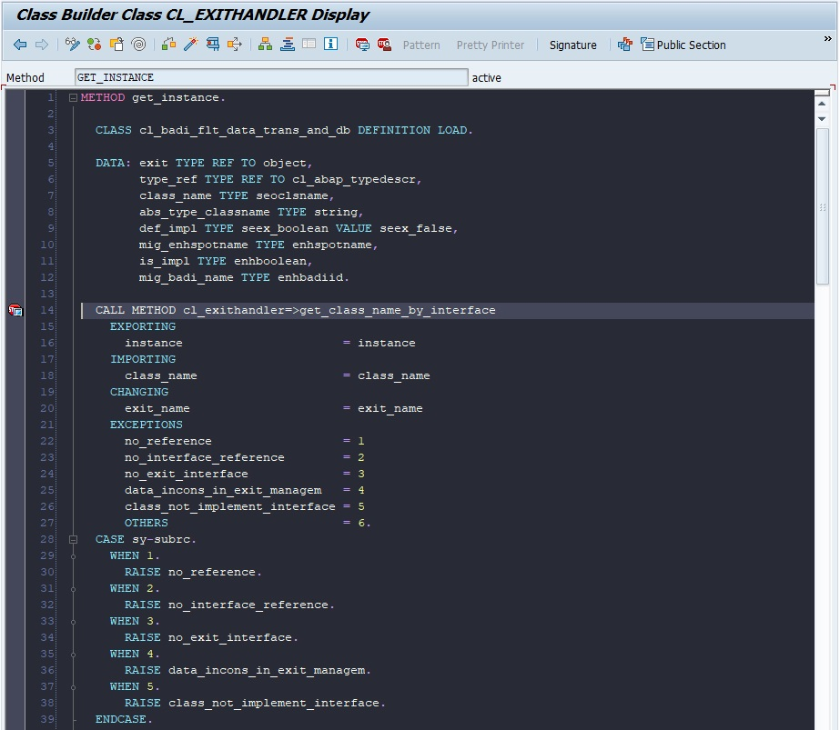

# FIND BADI OR EXIT

    An easy technique to find BADI or Exit in standard SAP program is by using the class CL_EXITHANDLER.

    Please find below an example on how to find BADIs or Exits which are available when the transaction VA03 is execute.

1. Go to transaction code [SE24](../22_Transactions/TCODE_SE24.md) and display the class `CL_EXITHANDLER`.

2. Double click on the method `GET_INSTANCE`

3. Set a break point on method `CL_EXITHANDLER`=>`GET_CLASS_NAME_BY_INTERFACE`

4. Execute [TRANSACTION VA03](../22_Transactions/TCODE_VA03.md) for exemple, the debugger will open and it will stop at the breakpoint set up above.