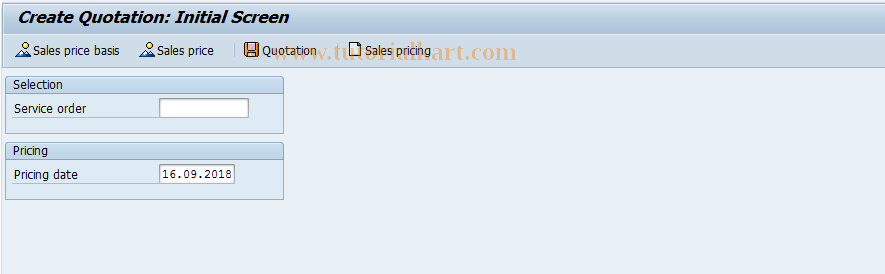

# **DP80 - Création d'offre - SM: Resource-Related Quotation**

|                  | Description                            |
|-----------------:|----------------------------------------|
|        SAP TCODE | DP80                                   |
|      Description | SM: Ressource-Related Quotation        |
|          Package | VPK                                    |
|     Program Name | SAPLVPK_GUI_INTRO                      |
|    Screen Number | 200                                    |
| Transaction Type | T                                      |

## ROLES

Le SAP TCode DP80 est utilisé pour la tâche : SM : Resource-Related Quotation. Le TCode appartient au package VPK.

- Création d'un `devis` en lien à l'`ordre de réparation sur coûts prévisionnels` ([TRANSACTION IW32](./TCODE_IW32.md)).

## LIENS

- [TRANSACTION IW32](./TCODE_IW32.md)

## TRANSACTION

