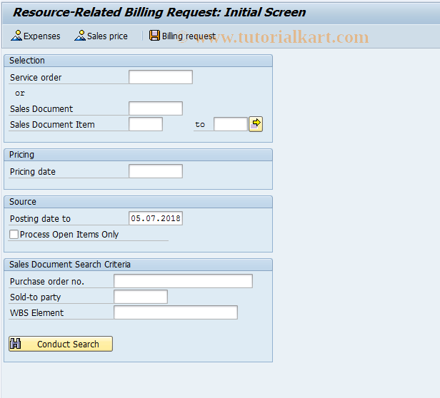

# **DP90 - Demande de facture sur charges réelles - CS: Resource-Related Billing Document**

|                  | Description                            |
|-----------------:|----------------------------------------|
|        SAP TCODE | DP90                                   |
|      Description | CS: Ressource-Related Billing Document |
|          Package | VPK                                    |
|     Program Name | SAPLVPK_GUI_INTRO                      |
|    Screen Number | 300                                    |
| Transaction Type | T                                      |

## ROLE

Le SAP TCode DP90 est utilisé pour la tâche : CS : Resource-Related Billing Document. Le TCode appartient au package VPK.

- Création d'une `demande de facturation sur charges réelles` délcarées dans la [TRANSACTION IW42](./TCODE_IW42.md).

## LIENS

- [TRANSACTION IW42](./TCODE_IW42.md)

## TRANSACTION

