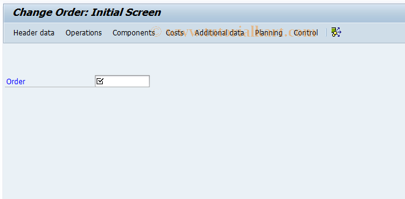

# **IW32 - Modifier Ordre - CHANGE ORDER**

|                  | Description                                                     |
|-----------------:|-----------------------------------------------------------------|
| SAP TCODE        | IW32                                                            |
| Description      | CHANGE ORDER                                                    |
| Package          | IWO1                                                            |
| Program Name     | SAPLCOIH                                                        |
| Screen Number    | 101                                                             |
| Transaction Type | T                                                               |

## ROLES

Le SAP TCode IW32 est utilisé pour la tâche : CHANGE ORDER. Le TCode appartient au package IWO1.

- Création d'un `ordre de réparation sur coûts prévisionnels` (temps d'intervention et pièces).

- Acceptation du `devis`.

- Génération automatique d'une `commande de vente sur charges prévisionnelles`.

- Génération automatiquement d'une `commande de vente sur charges réelles`

## LIENS

- [TRANSACTION DP80](./TCODE_DP80.md)

## TRANSACTION

