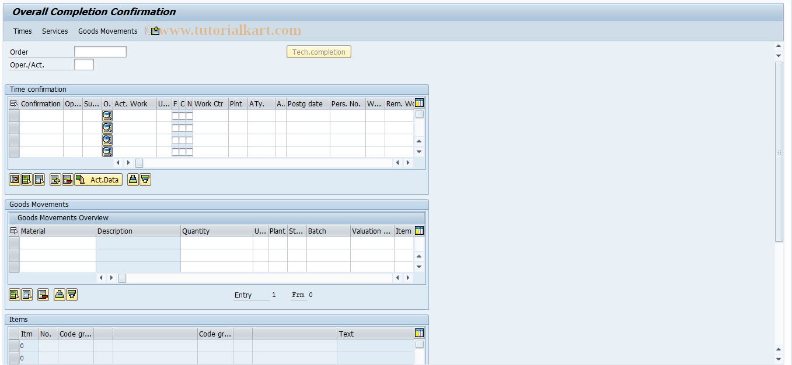

# **IW42 - Confirmation Globale - Overall Completion Confirmation**

|                  | Description                                                           |
|-----------------:|-----------------------------------------------------------------------|
|        SAP TCODE | IW42                                                                  |
|      Description | Overall Completion Confirmation                                       |
|          Package | IOCF                                                                  |
|     Program Name | SAPLCMFU                                                              |
|    Screen Number | 1                                                                     |
| Transaction Type | T                                                                     |

## ROLES

Le SAP TCode IW42 est utilisé pour la tâche : Confirmation globale d'achèvement. Le TCode appartient au package IOCF.

- `Intervention` (physique) et `confirmation` du temps et pièces réellement utilisées : `déclaration charges réelles`.

## LIENS

- [TRANSACTION DP90](./TCODE_DP90.md)

## TRANSACTION

