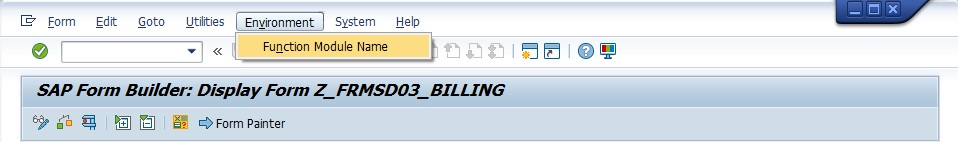
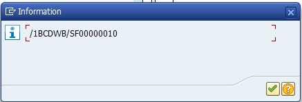
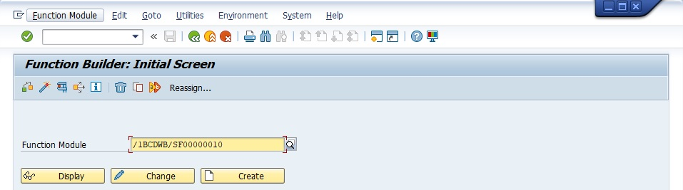

# **SMARTFORMS - SMARTFORMS**

|                  | Description                            |
|-----------------:|----------------------------------------|
|        SAP TCODE | SMARTFORMS                             |
|      Description | SMARTFORMS                             |
|          Package |                                        |
|     Program Name | SE37                                   |
|    Screen Number |                                        |
| Transaction Type |                                        |

## ROLE

Le SAP TCode SMARTFORMS est utilisé pour la tâche : Création de Smartofms. Débbuger un Smartforms en SE37 avec son `Fonction Module Name`.

