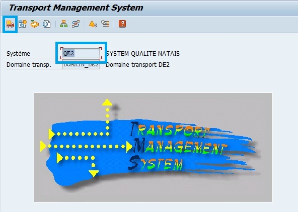
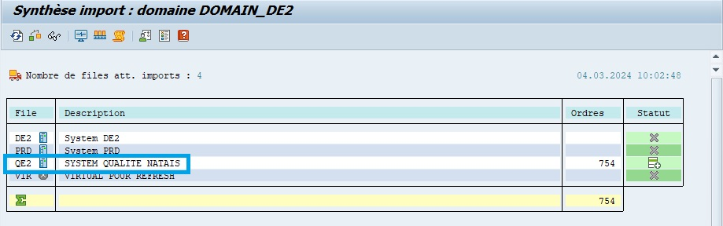
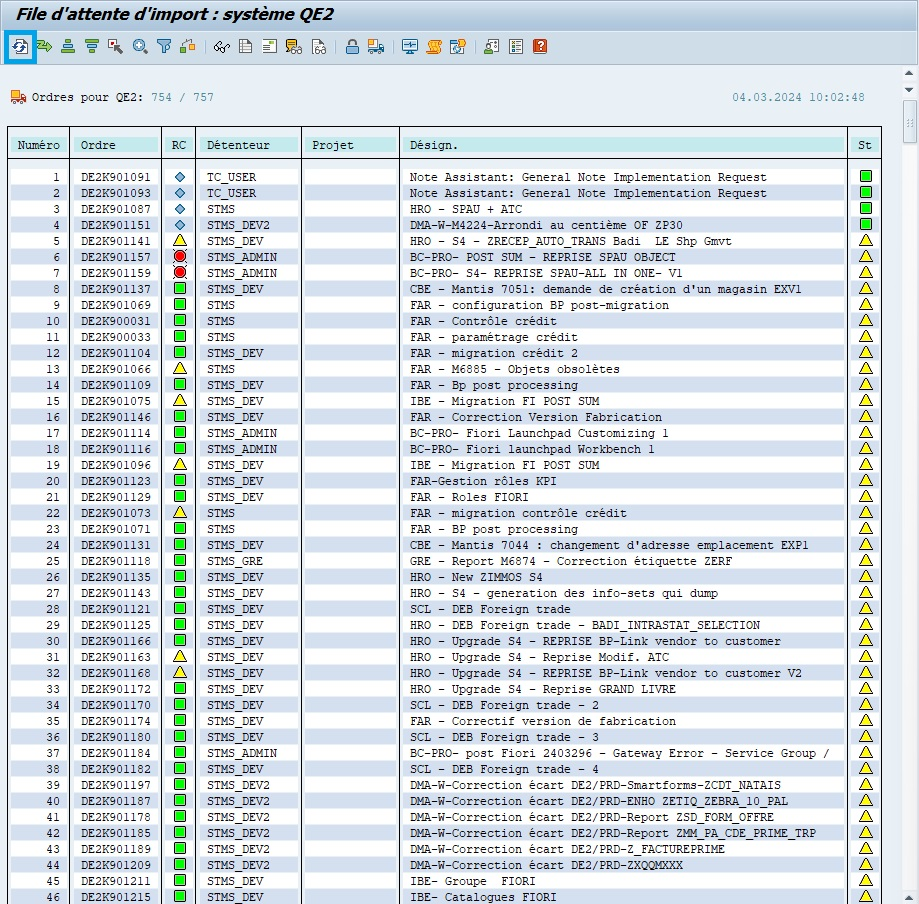
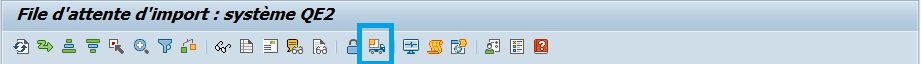
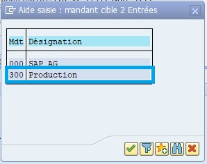
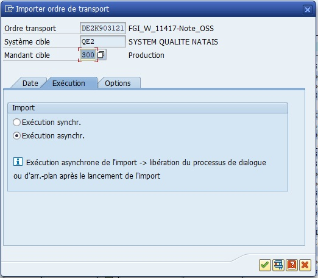
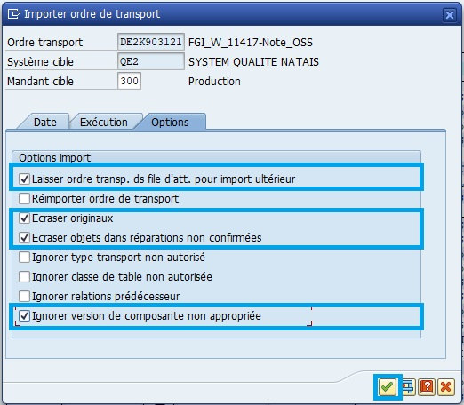

# **OT**

[TRANSACTION SE10](../22_Transactions/TCODE_SE10.md)

## CREATION OT

1.  Créer...

     

2.  Sélectionner l'ordre

    

3.  Nommer l'OT

    

## VISUALISATION OT

1.  Entrer le créateur de l'OT désiré (ou *)

    

2.  Afficher

    

3.  Visualiser

    

## COMPARAISON OT

1.  Double clic sur l'OT pour visulaiser les objets.

    

2.  Double clic sur l'objet à comparer.

    

3.  Utilitaires > Versions > Gestion des versions

    

4.  Sélectionner (avec [CTRL]) les versions à comparer (mauvais exemple ici car il n'y a qu'une seule version)

    

5.  Comparer

    

## MODIFICATION SUR UN OT

1.  Créer un nouvel OT ou utiliser un OT spécifié préalablement.

2.  Ouvrir l'objet à modifier en [SE80](../22_Transactions/TCODE_SE80.md), [SE24](../22_Transactions/TCODE_SE24.md), ...

3.  Enregsitrer et activer l'objet sous le nouvel OT.

## LIBERER UN OT

1.  Pour chaque sous-objets, sélectionner en un.

    

2.  Libérer le sous-objet.

    

3.  Répéter pour chaque sous-objet.

4.  Sélectionner l'OT.

    

5.  Libérer l'OT

    

6.  La fenètre change et fera état de la progression du transport de l'OT.
    Il sera nécessaire parfois d'actualiser pour vérifier que le transport progresse et se termine correctement.

## MONTER L'OT EN QUAL

1.  Aller dans l'[ENVIRONNEMENT]() visé, exemple :

    - [DEV]() to [QAL]()
    
    - [QAL]() to [PROD]()

2.  [TRANSACTION STMS](../22_Transactions/TCODE_STMS.md)

    

    - Système: "QE2"
        - [Synthèse Import]

3.  Sélectionner (double-clic) l'environnement sur lequel vous voulez importer l'OT (ici"QE2")

    

4.  Rafraichir la page et chercher l'OT. La liste 

    

5.  Dans cet exemple, l'OT a déjà été importé mais pour ce faire, sélectionner l'OT, puis [F9] et enfin [Importer Ordre] Ctrl+F11.

        Attention à utiliser le bon "Camion" !!!

        Le bon camion est celui qui est à moitié remplie !

    

6.  Remplisser le [Mandant Cible] en sélectionnant le mandt "Production"

    

    Le mandt "SAP AG" est celui par défaut (pour SAP)

7.  Ne rien faire dans l'onglet "Exécution"

    

8.  Sélectionner les options suivantes et valider

    