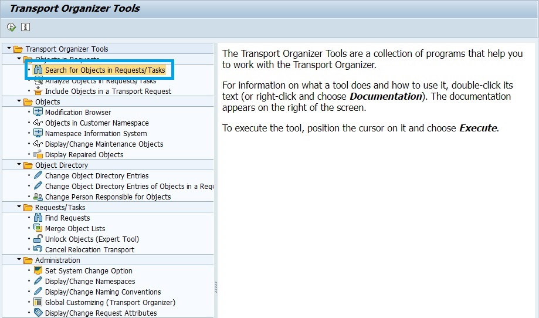
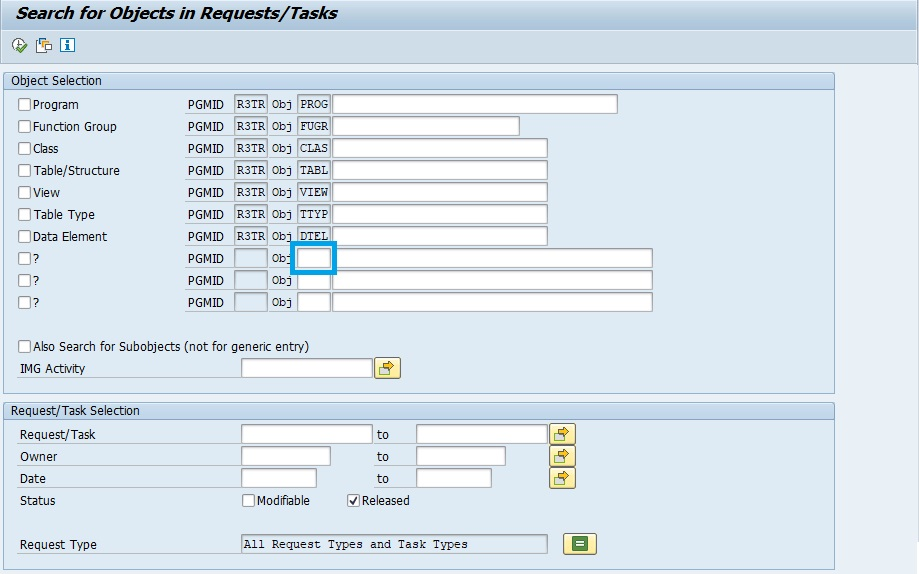
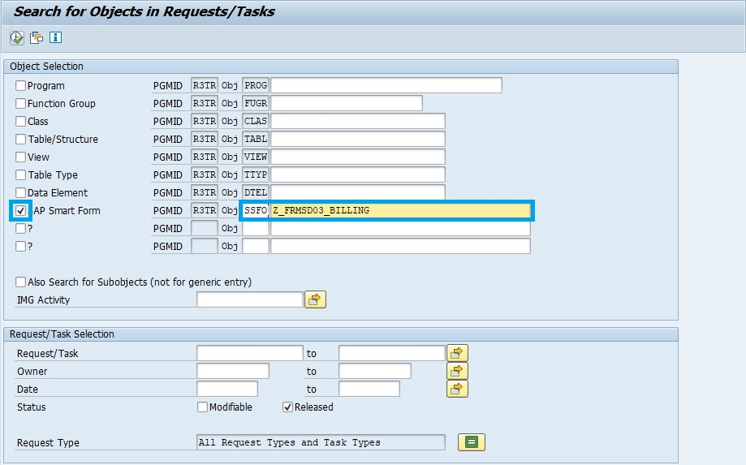
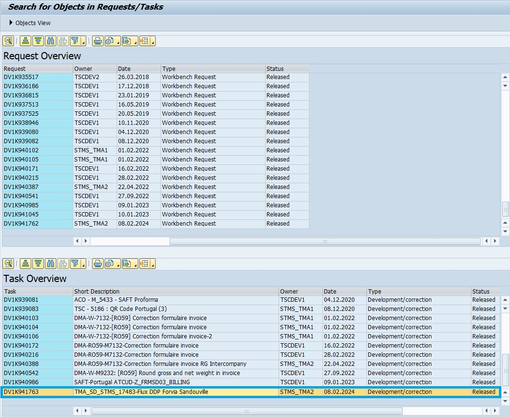

# **SMARTFORMS OT**

        Transporter un smartform vers un OT nécessite des manipulation spécifiques.

1.  [TRANSACTION SE03](../22_Transactions/TCODE_SE03.md)

    

    

2.  Entrez `SSFO` dans la 1ère colonne accessible à l'entrée, le nom du smartform dans la case de droite puis [Entrer].

    

3.  Rechercher l'OT parmis ceux qui ne sont pas "Released" (dans cet exemple, l'OT que nous cherchions a été released)

    

4.  Aller dans la [TRANSACTION SE10](../22_Transactions/TCODE_SE10.md) et rechercher l'OT avec son identifiant et libérer.