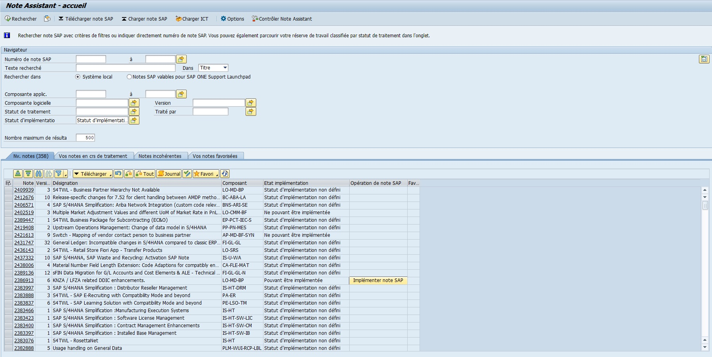
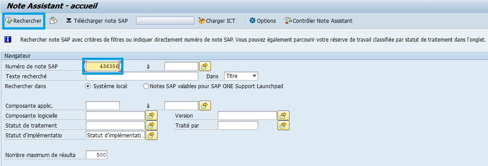
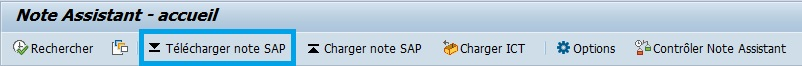
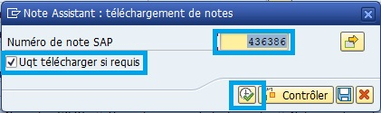
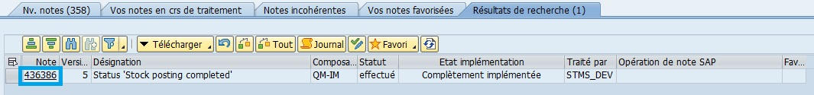
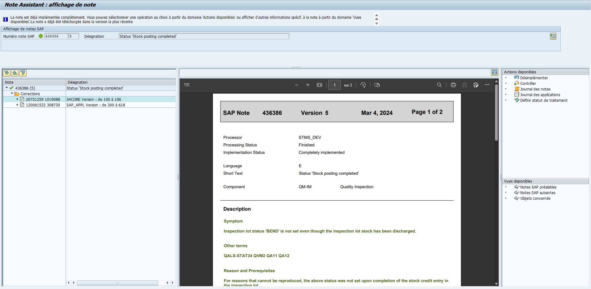
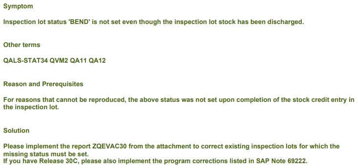
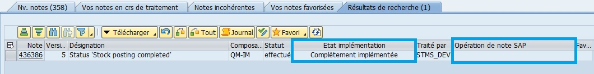
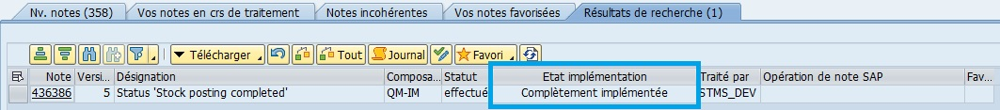

# **NOTE**

[TRANSACTION SNOTE](../22_Transactions/TCODE_SNOTE.md)

## INSTALLATION DE NOTE

1.  Aller dans l'environnement DEV du client

2.  Chercher dans la [TRANSACTION SNOTE] si le note existe en entrant son numéro OSS (i.e OSS 436386)

    

3.  Télécharger la note

    

    

4.  Accéder à la documentation

    

    

5.  Analyser les informations concernant :

    - "Symptom" que la note va rectifier

    - "Other terms" (environnement ciblé)

    - "Reason and Prerequisites" pour les motifs de la note et ses prérequis

    - "Solution" apportée par la note.

    

8.  Dans [Opération de note SAP], cliquer sur le bouton [Implémenter] (exemple non représentatif car la note est déjà implémentée)

    

9.  Si demandé, il sera nécessaire de créer un report spécifique pour la note dans la [TRANSACTION SE80](../22_Transactions/TCODE_SE80.md).

    Créer le report, activer le report puis quitter.

10. Retourner dans la [TRANSACTION SNOTE](../22_Transactions/TCODE_SNOTE.md) et [Implémenter] la note en définissant un [OT](../23_OT/README.md).

11. Vérifier l'état de l'implémentation de la note

    

12. Libérer l'[OT](../23_OT/README.md)